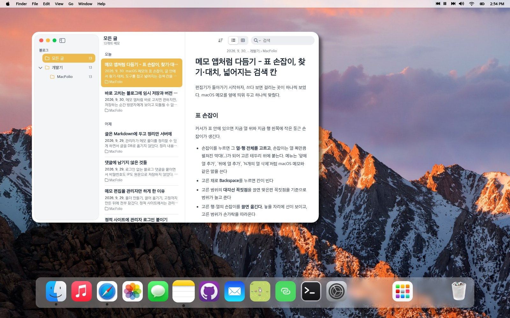
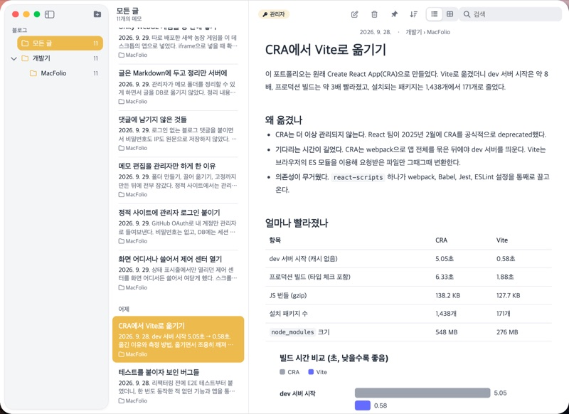
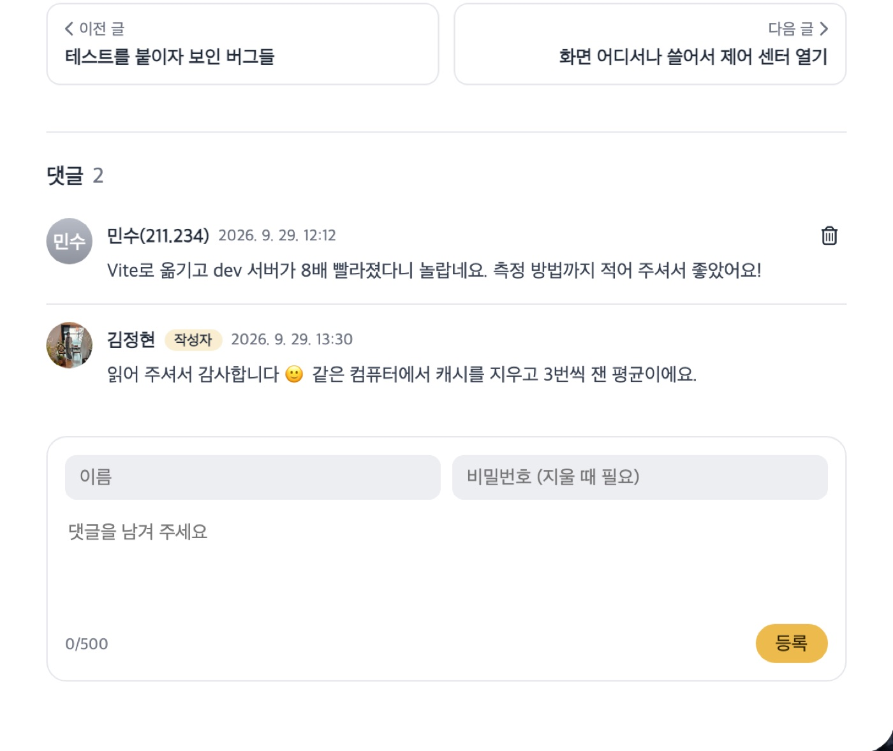
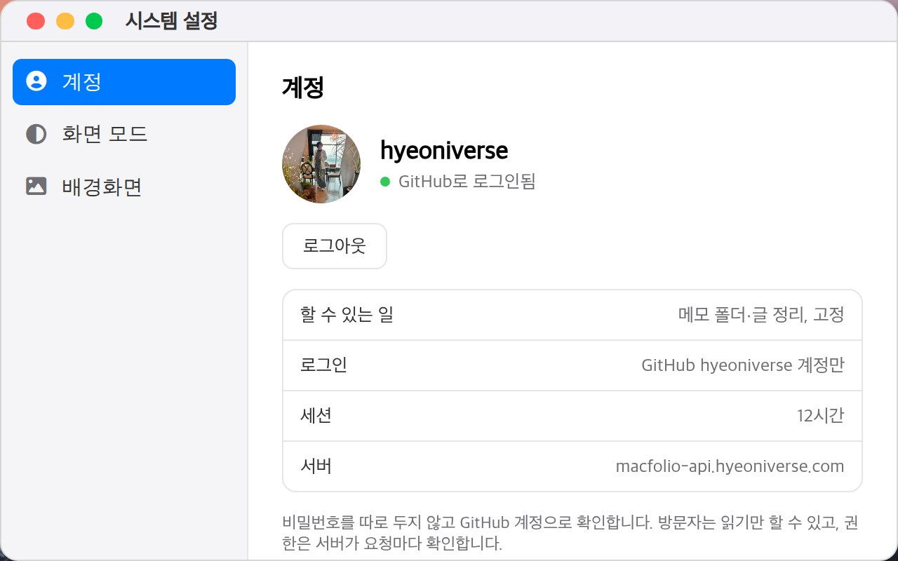
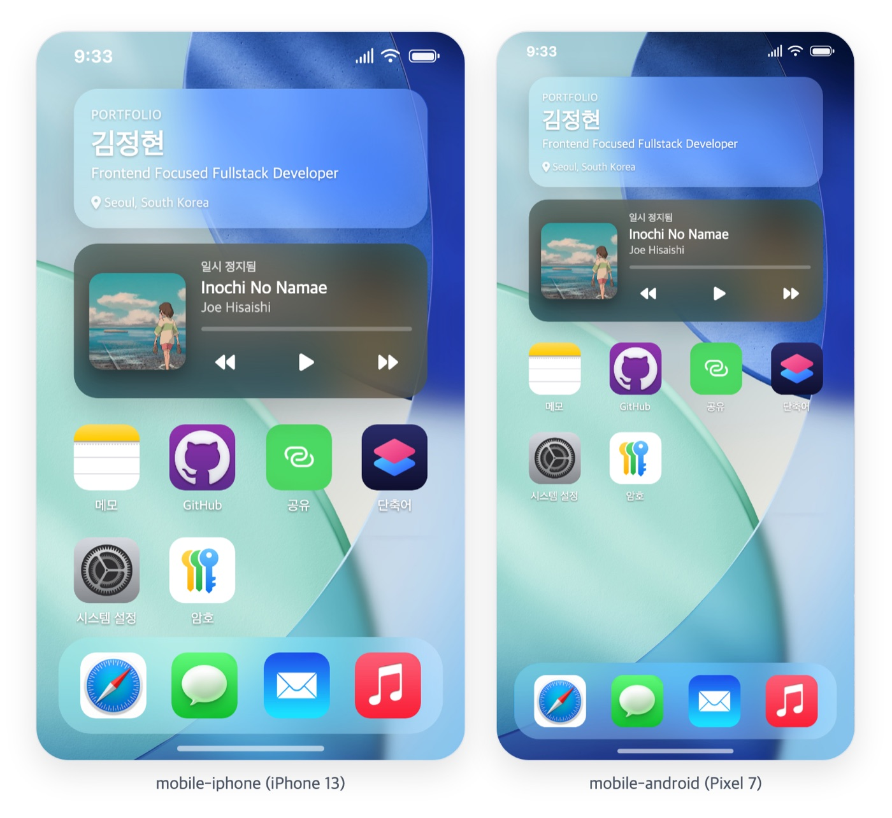
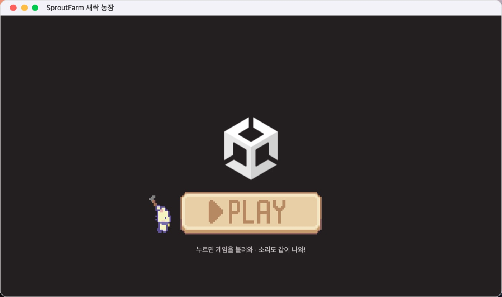

<div align="center">

# MacFolio

**macOS 데스크톱을 웹으로 옮긴 포트폴리오**

Dock에서 앱을 열고, 창을 끌어 옮기고, 메모 앱에서 블로그를 읽습니다.<br>
휴대폰으로 열면 iOS 홈 화면이 됩니다.

[**macfolio.hyeoniverse.com**](https://macfolio.hyeoniverse.com) · [API 문서](https://macfolio-api.hyeoniverse.com/docs) · [로드맵](https://github.com/hyeoniverse/MacFolio/issues/8)

[](https://github.com/hyeoniverse/MacFolio/actions/workflows/ci.yml)




</div>

## 둘러보기

<table>
  <tr>
    <td width="50%"></td>
    <td width="50%"></td>
  </tr>
  <tr>
    <td><b>메모 = 블로그</b><br>폴더·갤러리 보기, 검색과 찾기·대치. 관리자로 로그인하면 글이 곧 편집기가 되고, 임시 저장·게시·버전 기록을 남깁니다.</td>
    <td><b>메시지 = 방명록</b><br>이름과 비밀번호만으로 피드백을 남기고 답글을 답니다.</td>
  </tr>
  <tr>
    <td></td>
    <td></td>
  </tr>
  <tr>
    <td><b>댓글</b><br>로그인 없이 쓰고 같은 비밀번호로 지웁니다. 서버에는 비밀번호 해시와 IP의 HMAC만 남습니다.</td>
    <td><b>관리자 로그인</b><br>GitHub OAuth로 내 계정만 들여보냅니다. 비밀번호가 없고, DB에는 세션 토큰의 해시만 둡니다.</td>
  </tr>
  <tr>
    <td></td>
    <td></td>
  </tr>
  <tr>
    <td><b>모바일</b><br>휴대폰에서는 iOS 홈 화면과 위젯, 제어 센터 스와이프로 바뀝니다.</td>
    <td><b>프로젝트</b><br>배포한 게임(새싹 농장)을 창 안에서 바로 실행합니다. Safari, GitHub 앱에서 다른 프로젝트를 봅니다.</td>
  </tr>
</table>

## 사용법

### 방문자

| 하고 싶은 것       | 방법                                                                                         |
| ------------------ | -------------------------------------------------------------------------------------------- |
| 앱 열기            | Dock의 아이콘을 누릅니다. 터미널에서 `open memo`처럼 열 수도 있습니다                        |
| 창 다루기          | 제목 막대를 끌어 옮기고, 가장자리를 끌어 크기를 바꿉니다. 🔴 닫기 · 🟡 최소화 · 🟢 전체 화면 |
| 블로그 읽기        | 메모 앱. 왼쪽 폴더로 좁히고, 위의 버튼으로 목록/갤러리를 바꾸고, 검색 칸에서 찾습니다        |
| 링크 공유하기      | 메모의 글, Safari의 프로젝트에서 공유 버튼을 누르면 주소가 복사됩니다 (휴대폰은 공유 시트)   |
| 피드백 남기기      | 메시지 앱에서 이름·비밀번호·내용을 적습니다. 같은 비밀번호로 지울 수 있습니다                |
| 저에 대해 알아보기 | 터미널에서 `help`, `about`, `skills`, `projects`, `contact`                                  |
| 화면 바꾸기        | 시스템 설정 → 화면 모드(라이트·다크), 배경화면                                               |

글과 프로젝트마다 주소가 있습니다. `/memo/<글>`(예: `/memo/cra-to-vite`)이나 `/safari/<프로젝트>`(예: `/safari/sproutfarm`)로 들어오면, 로딩 화면 다음에 그 앱이 그 화면으로 열립니다. 글이나 탭을 고르면 브라우저 주소 막대도 맨 앞 창의 주소로 바뀝니다.

휴대폰에서는 홈 화면의 아이콘을 누르고, 아래쪽 막대를 위로 쓸어 올려 홈으로 돌아갑니다. 위에서 아래로 쓸면 제어 센터가 열립니다. 터미널은 명령을 눌러 실행하는 **단축어**로 바뀝니다.

### 관리자

1. 데스크톱은 **메뉴 막대 왼쪽의 Apple 메뉴 → 관리자 로그인**, 휴대폰은 **암호** 앱에서 GitHub로 로그인합니다.
2. 메모 앱에서 글을 누르면 바로 고칠 수 있습니다. 고치는 동안은 임시 저장만 되고, **게시**해야 방문자에게 보입니다. 미래 날짜로 게시하면 예약됩니다.
3. 폴더 만들기·이름 바꾸기, 글 옮기기(끌어 놓기), 고정, 댓글 지우기도 로그인했을 때만 됩니다.
4. 로그인 상태와 세션은 **시스템 설정 → 계정**에서 봅니다. 세션은 12시간입니다.

화면의 편집 버튼을 숨기는 것은 안내일 뿐이고, 권한은 서버가 요청마다 확인합니다.

## 기술 스택

한눈에 보면 이렇습니다. 아래에 **왜 골랐는지, 어디에 어떻게 썼는지**를 적었습니다. 결정 과정은 [#8](https://github.com/hyeoniverse/MacFolio/issues/8)에 있습니다.

| 영역       | 사용한 것                                                                                 |
| ---------- | ----------------------------------------------------------------------------------------- |
| 프론트엔드 | React 19, TypeScript, Vite, Milkdown(편집기), react-markdown + lowlight                   |
| 백엔드     | NestJS, Prisma 7, PostgreSQL, Swagger                                                     |
| 모노레포   | pnpm workspaces, Turborepo                                                                |
| 테스트     | Vitest(단위), Playwright(E2E: 데스크톱·iPhone·Android), supertest(API e2e)                |
| 배포       | Cloudflare Workers(프론트엔드), Oracle Cloud VM + Docker Compose + Cloudflare Tunnel(API) |
| CI         | GitHub Actions: 포맷 → 린트 → 타입 체크 → 테스트 → 빌드 → API e2e → E2E, 규칙 검사        |

### 프론트엔드

**React 19 + TypeScript + Vite**

- **왜:** 화면이 데스크톱 하나뿐이고 창 끌기, 오디오, 제스처가 모두 브라우저에서 돕니다. 라우팅이나 서버 렌더링이 필요 없어서 Next.js 대신 SPA로 두었습니다. 처음 쓰던 Create React App이 2025년 2월 deprecated되어 Vite로 옮겼고, dev 서버 시작이 5.05초에서 0.58초로 줄었습니다([측정](docs/migration-cra-to-vite.md))
- **어떻게:**
  - 앱마다 폴더 하나(`src/apps/<앱>`)를 두고, `manifest.ts` 한 곳에서 이름·아이콘·창 크기·모바일 이름을 정합니다. Dock, Launchpad, 터미널의 `open`, 모바일 홈 화면이 모두 이 목록을 읽습니다
  - 창 위치·앞뒤 순서, 관리자 로그인 상태, 음악 재생은 작은 저장소(`createStore`)에 두고 `useSyncExternalStore`로 구독합니다. React에 묶이지 않은 형태라 나중에 로직을 프레임워크 밖으로 떼어 낼 수 있습니다(#16)
  - Vite의 `import.meta.glob`으로 블로그 글(Markdown)과 이미지를 빌드할 때 함께 묶습니다. `VITE_API_URL`도 빌드할 때 코드에 들어갑니다
  - 메모 창은 CSS 컨테이너 쿼리로 창 폭에 따라 도구 막대와 목록 배치를 바꿉니다. 화면 폭이 아니라 창 폭이 기준이라 창을 줄여도 맞게 바뀝니다

**Milkdown (편집기)**

- **왜:** 관리자가 글을 **보이는 그대로** 고치고, 저장은 Markdown으로 하고 싶었습니다. Milkdown은 ProseMirror 위에서 Markdown을 그대로 읽고 씁니다. 저장소의 글 파일과 서버에 저장한 글이 같은 형식이라 서로 겹쳐 보여 줄 수 있습니다
- **어떻게:** 가가(서식) 메뉴, 체크리스트·표·이미지 블록, 표 손잡이, ⌘F 찾기·대치를 ProseMirror 플러그인과 명령으로 만들었습니다(`src/apps/memo/writer/`). 편집 화면과 읽기 화면이 같은 CSS를 쓰게 맞춰서, 로그인해도 글 모양이 바뀌지 않습니다

**react-markdown + remark-gfm + lowlight (읽기 화면)**

- **왜:** 방문자에게는 편집기가 필요 없습니다. 가벼운 렌더러로 표·체크리스트(GFM)까지 보여 주고, 코드 문법 강조는 편집기와 같은 lowlight를 써서 두 화면의 색을 똑같이 맞췄습니다
- **어떻게:** 이미지는 캡션·크게 보기·내려받기 단추가 있는 컴포넌트로 바꿔 그리고, 글 안에서 찾기는 DOM을 건드리지 않고 CSS Custom Highlight API(`::highlight()`)로 칠합니다

### 백엔드

**NestJS**

- **왜:** 정적 사이트만으로는 관리자를 가릴 수 없고, 처음 쓰던 Firebase는 규칙이 열려 있어 누구나 비밀번호를 평문으로 읽을 수 있었습니다. 검증을 서버에서 하는 API가 필요했습니다. Hono·Cloudflare Workers도 검토했지만 국내 채용 공고에 자주 나오고, 모듈·가드·파이프 구조가 Spring과 닮아 설계가 잘 드러나는 NestJS를 골랐습니다
- **어떻게:**
  - `AdminGuard`: 관리자 전용 API(글쓰기, 메모 정리, 업로드)가 요청마다 세션 쿠키를 DB에서 확인합니다. 화면의 편집 버튼을 숨기는 것과 상관없이 서버가 막습니다
  - `ValidationPipe` + class-validator: 모든 입력을 DTO로 검사하고, 정해 두지 않은 필드는 거절합니다
  - `@nestjs/throttler`: 로그인·댓글에 IP별 요청 제한. 터널 뒤에서는 `TRUST_PROXY`로 실제 IP를 읽습니다
  - helmet(보안 헤더), CORS는 사이트 주소만 허용, 전역 예외 필터로 에러 모양을 하나로 맞추고 예상하지 못한 에러는 내용을 감춥니다
  - Swagger: 컨트롤러에서 [API 문서](https://macfolio-api.hyeoniverse.com/docs)를 자동으로 만듭니다

**Prisma 7 + PostgreSQL**

- **왜:** 스키마 하나에서 타입과 마이그레이션이 함께 나와, 프론트엔드와 같은 TypeScript로 DB를 다룹니다. PostgreSQL은 CHECK 제약으로 규칙을 DB에서도 한 번 더 지킬 수 있어서 골랐습니다
- **어떻게:**
  - 글은 **게시한 내용과 임시 저장을 한 행에 두 벌** 두고, 게시할 때마다 버전(`PostRevision`)을 남깁니다. "게시했다면 제목·본문이 있어야 한다" 같은 규칙은 CHECK 제약으로 겁니다(Prisma 스키마로는 못 적어서 마이그레이션 SQL로)
  - 세션은 토큰 원문 대신 SHA-256 해시만, 댓글 비밀번호는 scrypt 해시만, IP는 HMAC만 저장합니다
  - 올린 이미지·첨부 파일도 DB(`bytea`)에 둡니다. 서버 한 대라 파일 저장소를 따로 두지 않고, 백업 한 번에 글과 파일이 함께 남습니다
  - 서버가 시작할 때 `prisma migrate deploy`로 마이그레이션을 적용합니다

**GitHub OAuth (관리자 로그인)**

- **왜:** 관리자는 저 한 명입니다. 비밀번호를 만들면 해시·재설정까지 만들어야 해서, 이미 쓰는 GitHub 계정으로 확인합니다
- **어떻게:** `state` 쿠키로 로그인 CSRF를 막고, 계정 이름이 아니라 바뀌지 않는 숫자 ID로 관리자를 가립니다. 세션 쿠키는 `httpOnly`·`Secure`·`SameSite=Lax`, 12시간

### 모노레포: pnpm workspaces + Turborepo

- **왜:** 프론트엔드와 API를 한 저장소에 두고 한 번에 고치고 테스트하려고 모노레포로 묶었습니다. pnpm은 설치가 빠르고 의존성이 엄격하고, Turborepo는 패키지 사이 빌드 순서와 캐시를 맡습니다
- **어떻게:** 루트의 `pnpm build`·`pnpm test`·`pnpm lint`가 두 앱을 함께 돌립니다. `pnpm dev:all`로 프론트엔드와 API를 같이 띄웁니다

### 테스트

**Vitest (단위)**: 창 위치 계산, 메모 정리·검색·찾기 규칙, 입력 규칙, 세션·해시처럼 화면과 떨어진 순수 함수를 확인합니다. Vite와 설정을 같이 써서 따로 번들 설정이 없습니다

**Playwright (E2E)**

- **왜:** 이 사이트는 끌기, 쓸어 넘기기, 애니메이션처럼 실제 브라우저에서만 드러나는 동작이 많습니다
- **어떻게:**
  - 데스크톱 Chrome, iPhone, Android 세 가지 화면에서 돕니다
  - 관리자 기능은 `page.route`로 만든 **가짜 API**로 테스트합니다. 서버 없이 로그인·글쓰기·게시·댓글을 확인하고, README와 블로그의 스크린샷도 같은 가짜 API로 찍었습니다
  - 빌드한 결과(`vite preview`)를 대상으로 돌려서 배포될 코드와 같은 것을 확인합니다

**supertest (API e2e)**: 실제 PostgreSQL에 붙여 권한(비관리자는 401, 규칙 위반은 400), 해시만 저장하는지, 요청 제한(429)까지 확인합니다. GitHub에 요청하는 부분만 가짜로 바꿉니다

### 배포

**Cloudflare Workers (프론트엔드)**

- **왜:** 정적 파일이라 서버가 필요 없고, 도메인 DNS가 이미 Cloudflare에 있습니다. main에 머지하면 빌드·배포되고, PR마다 미리보기 주소가 생깁니다
- **어떻게:** Worker 스크립트 없이 `dist`만 정적 자산으로 올리고, 없는 경로는 `index.html`로 보냅니다(SPA)

**Oracle Cloud Always Free VM + Docker Compose (API)**

- **왜:** 기간 제한 없이 무료인 VM입니다. Render 같은 무료 호스팅은 15분 동안 요청이 없으면 잠들어, 깨어나는 데 1분쯤 걸립니다. EC2와 같은 구조(리눅스 VM + Docker)라 직접 운영해 볼 수 있습니다
- **어떻게:** Postgres, API, cloudflared를 compose로 함께 띄웁니다. 멀티 스테이지 Dockerfile로 실행 이미지에는 컴파일 결과와 실행 의존성만 넣고, amd64·arm64 모두 빌드됩니다

**Cloudflare Tunnel (HTTPS)**

- **왜:** nginx + Let's Encrypt를 쓰면 80/443 포트를 열고 인증서를 갱신해야 합니다. 터널은 서버가 Cloudflare로 **나가는** 연결만 만들어서 SSH 말고는 포트를 열지 않고, 서버 IP도 드러나지 않습니다
- **어떻게:** 프론트엔드(`macfolio.`)와 API(`macfolio-api.`)를 같은 사이트(`hyeoniverse.com`)의 하위 도메인으로 두어, 세션 쿠키가 `SameSite=Lax`로도 함께 갑니다

자세한 순서는 [docs/deployment.md](docs/deployment.md)에 있습니다.

### CI: GitHub Actions

- PR과 main push마다 포맷 → 린트 → 타입 체크 → 단위 테스트 → 빌드 → API e2e(PostgreSQL 서비스 컨테이너) → 브라우저 E2E를 차례로 돌립니다. 실패하면 Playwright 리포트를 올립니다
- `conventions`: 브랜치 이름, PR 제목, 커밋 메시지가 [작업 규칙](CONTRIBUTING.md)을 따르는지 확인합니다
- `main`의 Ruleset이 `check`와 `conventions`를 필수 검사로 걸어 두어, 둘 다 통과해야 머지됩니다([설정 방법](CONTRIBUTING.md#저장소-설정))

## 구조

```
apps/
  react/                  데스크톱 UI (Vite + React)
    src/apps/             앱마다 폴더 하나 (manifest.ts가 앱 목록의 단일 출처)
    src/apps/memo/content 블로그 글 (Markdown)
    src/desktop/          창 관리, Dock, 메뉴 막대, 모바일 셸
    e2e/                  Playwright
  api/                    NestJS API (관리자 로그인, 글, 댓글, 이미지, 메모 정리)
docs/                     배포, 마이그레이션 기록
wrangler.jsonc            Cloudflare Workers 설정
```

## 로컬에서 실행

Node 22와 pnpm이 필요합니다(버전은 `.node-version`과 `package.json`에 고정).

```bash
corepack enable
pnpm install
pnpm dev          # 프론트엔드만: http://localhost:5173
```

설정 없이 바로 뜹니다. API가 없으면 로그인과 편집만 꺼지고, 블로그는 저장소의 Markdown으로 보입니다.

API까지 띄우려면 Docker가 필요합니다.

```bash
cp apps/api/.env.example apps/api/.env          # GitHub OAuth 값은 개발용 OAuth App으로
echo 'VITE_API_URL=http://localhost:4000' > apps/react/.env.local
pnpm --filter @macfolio/api db:up                # PostgreSQL
pnpm dev:all                                     # 프론트엔드 5173 + API 4000 (문서: /docs)
```

| 명령                                     | 설명                           |
| ---------------------------------------- | ------------------------------ |
| `pnpm dev`                               | 프론트엔드 개발 서버           |
| `pnpm dev:api`                           | API 개발 서버                  |
| `pnpm dev:all`                           | 둘 다                          |
| `pnpm build`                             | 모든 패키지 빌드               |
| `pnpm typecheck`                         | 타입 체크                      |
| `pnpm lint`                              | 린트                           |
| `pnpm test`                              | 단위 테스트                    |
| `pnpm --filter @macfolio/api test:e2e`   | API e2e (DB 필요)              |
| `pnpm --filter @macfolio/react test:e2e` | 브라우저 E2E (`pnpm build` 후) |

## 블로그 글 쓰기

두 가지 방법이 있습니다.

- **사이트에서:** 관리자로 로그인해 메모 앱에서 바로 씁니다. 글은 서버(DB)에 저장되고, 저장소의 글을 고치면 같은 주소로 서버 글이 대신 보입니다.
- **저장소에서:** `apps/react/src/apps/memo/content/`에 Markdown 파일을 추가합니다. 파일 이름이 글의 주소 이름이 됩니다(예: `my-first-post.md`). main에 머지하면 배포됩니다.

```md
---
title: 글 제목
date: 2026-09-28
category: 개발기/MacFolio
summary: 목록에 보일 한 줄 요약 (없으면 본문 앞부분)
pinned: true # 목록 맨 위에 고정 (선택)
---

본문은 Markdown으로 씁니다. 표, 코드 블록, 링크를 쓸 수 있습니다.

')
```

- `title`과 `date`(YYYY-MM-DD)는 필수입니다. 없거나 형식이 틀리면 목록에서 빠지고, 개발 서버 콘솔에 경고가 나옵니다.
- `category`는 왼쪽 폴더가 됩니다. `/`로 하위 폴더를 만들 수 있고, 상위 폴더를 고르면 하위 폴더의 글까지 보입니다. 없으면 "기타"로 들어갑니다.
- 이미지는 `content/images/`에 넣고 글 파일 기준 상대 경로로 씁니다. 갤러리 보기에서는 본문의 첫 이미지가 카드 미리보기가 됩니다.

## 배포

| 무엇       | 어디에                                               | 어떻게                           |
| ---------- | ---------------------------------------------------- | -------------------------------- |
| 프론트엔드 | Cloudflare Workers                                   | main에 머지하면 자동             |
| API        | Oracle Cloud Always Free VM (Docker Compose)         | 서버에서 `git pull` 후 다시 빌드 |
| HTTPS      | Cloudflare Tunnel (서버는 SSH 말고 포트를 열지 않음) |                                  |

VM 만들기부터 OAuth App, 터널, 환경 변수, 문제 해결까지 [docs/deployment.md](docs/deployment.md)에 정리했습니다.

## CRA → Vite 마이그레이션

deprecated된 Create React App에서 Vite로 옮겼습니다.

| 항목           | CRA      | Vite     |
| -------------- | -------- | -------- |
| dev 서버 시작  | 5.05초   | 0.58초   |
| 프로덕션 빌드  | 6.33초   | 1.88초   |
| JS 번들 (gzip) | 138.2 KB | 127.7 KB |
| 설치 패키지 수 | 1,438개  | 171개    |

측정 방법과 전환 과정은 [docs/migration-cra-to-vite.md](docs/migration-cra-to-vite.md)에 정리했습니다.

## 문서

- [작업 규칙](CONTRIBUTING.md): 브랜치, 커밋, 이슈, PR, 저장소 설정(필수 검사)
- [배포](docs/deployment.md): Cloudflare Workers, Oracle VM, Cloudflare Tunnel, GitHub OAuth
- [CRA → Vite 마이그레이션](docs/migration-cra-to-vite.md)
- [API](apps/api/README.md): 로컬 실행, 테스트, 구조
- 개발기: 사이트의 메모 앱 → 개발기 폴더 (`apps/react/src/apps/memo/content/`)

## 로드맵

아키텍처 결정과 앞으로의 계획은 [#8](https://github.com/hyeoniverse/MacFolio/issues/8)에서 관리합니다.
