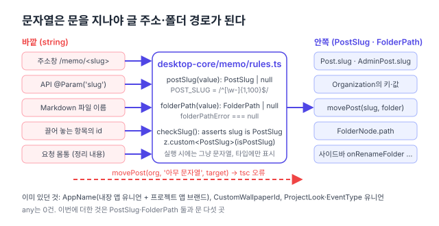

리팩터링 계획([#150](https://github.com/hyeoniverse/MacFolio/issues/150)) 1단계의 마지막 항목 "`any`, 넓은 `string` 대신 쓸 수 있는 유니언·브랜드 타입 정리 (앱 이름, 폴더 경로, 슬러그)". [프로필 나누기](/memo/profile-split) 다음이다.

## 먼저 센 것

`any`는 프로젝트 전체에 0건이었다. 앱 이름은 이미 돼 있었다. `apps/manifest.ts`의 `AppName`은 내장 앱 유니언(`'memo' | 'safari' | …`)과 프로젝트 앱 브랜드(`string & { [projectApp]: true }`)의 합이고, `projectAppName(id)`가 문이다. 배경화면 id는 `` `custom:${string}` `` 템플릿 리터럴, 분석의 `EventType`·`Breakdown`, 프로젝트의 `ProjectLook`도 유니언이다.

남은 것은 글 주소(slug)와 폴더 경로였다. 둘 다 어디서나 `string`이다. `Post.slug: string`, `Organization.posts: Record<string, string>`, `movePost(org, slug: string, folder: string)`. 주소창에서 온 문자열, 끌어 놓는 항목의 id, API 파라미터가 아무 검사 없이 그대로 들어갈 수 있었다. 서버는 `SLUG.test()`로, 화면은 암묵적으로 믿었다.



## 브랜드 타입

```ts
// packages/desktop-core/src/memo/rules.ts
declare const postSlugBrand: unique symbol;
export type PostSlug = string & { readonly [postSlugBrand]: true };
export type FolderPath = string & { readonly [folderPathBrand]: true };

export const isPostSlug = (value: unknown): value is PostSlug => typeof value === 'string' && POST_SLUG.test(value);
export const postSlug = (value: unknown): PostSlug | null => (isPostSlug(value) ? value : null);
export const folderPath = (value: unknown): FolderPath | null => (isFolderPath(value) ? value : null);
```

`unique symbol`로 표시를 붙인 문자열이다. 실행 시에는 그냥 문자열이라 번들에 아무것도 안 들어가고 동작도 안 바뀐다. 다른 점은 하나다. `string`을 `PostSlug` 자리에 넣으면 컴파일이 안 된다. `PostSlug`를 만드는 길은 `postSlug()`뿐이고, 그 함수는 `POST_SLUG` 정규식을 본다.

## 어디가 문인가

바깥에서 문자열이 들어오는 곳 다섯을 찾아 문을 세웠다.

| 어디서 온 문자열      | 문                                                  |
| --------------------- | --------------------------------------------------- |
| 주소창 `/memo/<slug>` | `useNoteView`의 `postSlug(linkedId('memo'))`        |
| API `@Param('slug')`  | `checkSlug(slug): asserts slug is PostSlug`         |
| Markdown 파일 이름    | `createStaticPostRepository`의 `postSlug(이름)`     |
| 끌어 놓는 항목의 id   | `useNoteDrag`의 `postSlug(id)`·`folderPath(target)` |
| 요청 몸통 (정리 내용) | `parseOrganization`이 검사한 뒤 브랜드로            |

서버가 DB에서 읽은 slug는 넣을 때 검사한 값이라 `row.slug as PostSlug`로 표시만 붙인다. contracts의 `ServerPost`·`AdminPost` 스키마는 `z.custom<PostSlug>(isPostSlug)`라 서버 응답의 slug도 모양을 확인한 뒤 브랜드가 된다.

안쪽은 `Post.slug`·`AdminPost.slug`, `Organization`의 키와 값, `movePost`·`setPinned`·`renameFolder` 같은 정리 함수, 폴더 트리의 `FolderNode.path`, 사이드바의 `onRenameFolder(path: FolderPath)` 콜백이다. 폴더 트리의 경로는 글의 category와 만든 폴더에서 오므로 트리를 만드는 한 곳에서 표시를 붙였다.

## 무엇을 브랜드하지 않았나

`PostContent.category`는 `string`으로 뒀다. 처음엔 `FolderPath`로 했다가 되돌렸다. 글 편집기의 입력 상태(`PostDraft`)가 `PostContent`와 같은 모양이라, 사용자가 타이핑하는 중간 값까지 `FolderPath`여야 했다. "폴더를 골라주세요"가 아직 안 된 상태를 타입이 표현할 수 없다. 브랜드는 "확인이 끝난 값"에 붙이는 것이지 입력 칸에 붙이는 것이 아니다. category는 `postInput` 스키마가 저장 전에 `folderPathError`로 검사한다.

## 비용

시험 픽스처다. `{ slug: 'a' }` 같은 리터럴 마흔세 곳이 `'a' as PostSlug`가 됐다. 브랜드 타입의 알려진 비용이고, 대신 픽스처가 "이건 검사 없이 믿는 값"이라고 적어 둔 셈이 됐다. 소스 코드에서 표시를 직접 붙인 곳은 넷뿐이다. DB 행을 읽는 서버(넣을 때 검사한 값), `parseOrganization`이 검사를 끝낸 값, 폴더 트리를 만드는 한 곳, 끌어 놓은 DOM `dataset`을 읽는 사이드바.

| 항목                      | 전               | 후                                |
| ------------------------- | ---------------- | --------------------------------- |
| slug·폴더 경로 타입       | `string`         | `PostSlug`·`FolderPath`           |
| 바깥 문자열이 들어오는 문 | 서버 1곳(정규식) | 5곳 (화면 3, 서버 1, 저장소 1)    |
| 동작 변화                 |                  | 없음 (Vitest 336·E2E 메모 그대로) |

이것으로 1단계 "타입과 데이터 구조" 네 항목이 끝났다. 다음은 4단계 공통 컴포넌트.

#MacFolio #리팩터링 #TypeScript
