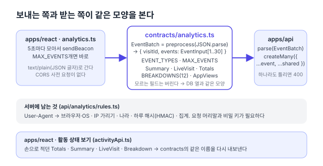

리팩터링 계획([#150](https://github.com/hyeoniverse/MacFolio/issues/150)) 1단계의 일곱째 PR. 댓글·글·메시지·연락 메일·배경화면·[파일](/memo/contracts-files)에 이어 트래픽 분석이다. 지금까지 가장 큰 요청 몸통이었다.

## 분석은 주고받는 모양이 셋이다

트래픽 분석(`/analytics`)은 이렇게 돈다. 사이트의 `analytics.ts`가 방문·앱 열기·글 보기·링크·떠남 이벤트를 모아 5초마다, 또는 30개가 차면 `sendBeacon`으로 보낸다. 서버는 `parseBatch`로 검사하고 요청 머리말에서 뽑은 것(나라, 브라우저, 하루 해시)을 붙여 DB에 넣는다. 관리자의 '활동 상태 보기'는 `/analytics/summary`와 `/analytics/live`를 읽는다.

그래서 모양이 셋이다. 보내는 모양, 받는 모양, 읽는 모양. 각각 `analytics.ts`의 `AnalyticsEvent`, 서버 `rules.ts`의 `parseBatch`(55줄, `if`문 열한 개), 화면 `activityApi.ts`의 `Totals`·`Summary`·`LiveVisit`에 있었다. 서버 쪽 응답 타입은 `analytics.service.ts`에 또 있었다.



## 이벤트 묶음

```ts
// packages/contracts/src/analytics.ts
export const EventInput = z.object({
	type: z.enum(EVENT_TYPES, { error: 'type이 올바르지 않습니다.' }),
	app: text(32, 'app').refine((app) => !app || APP_NAME.test(app), 'app이 올바르지 않습니다.'),
	referrer: text(253, 'referrer')
		.transform((r) => r?.toLowerCase())
		.refine(/* 호스트만 */),
	device: z.enum(['desktop', 'mobile']).optional(),
	duration: z.number().int().min(0).max(MAX_DURATION_MS).optional(),
	// item, path, utm*, language …
});

export const EventBatch = z.preprocess(
	(input) => (typeof input === 'string' ? tryJson(input) : input),
	z.object({ visitId: z.string().regex(VISIT_ID), events: z.array(EventInput).min(1).max(MAX_EVENTS) })
);
```

두 가지가 중요했다.

**JSON 글자도 받는다.** `sendBeacon`은 글자를 넘기면 `text/plain`으로 보내고, 그러면 CORS 사전 요청이 없다. 그래서 몸통이 JSON 객체가 아니라 JSON 글자로 온다. `z.preprocess`에서 글자면 `JSON.parse`를 시도하고, 실패하면 그대로 넘겨 "본문이 없습니다."가 나오게 했다.

**빈 글자는 없는 것으로, 모르는 필드는 버린다.** 서버는 검사한 이벤트를 `createMany({ data: events.map((e) => ({ ...e, ...shared })) })`로 그대로 DB에 넣는다. 검사 결과가 곧 DB 행이다. `''`가 남으면 빈 문자열이 저장되고, 모르는 필드가 남으면 Prisma가 거부한다. zod의 `object`는 모르는 키를 버리고, `text()` 전처리가 `''`를 `undefined`로 바꾼다. 이 둘을 시험으로 고정했다.

서버 `parseBatch`는 `parse(EventBatch, input)` 한 줄이 됐다. 400 문구는 그대로다.

## 서버에 남는 것

`rules.ts`에는 요청 머리말이나 비밀 키가 필요한 것만 남았다. User-Agent를 브라우저·OS로 줄이기, IP 가리기, 나라 두 글자, 하루 해시(HMAC), 하루치 집계. [파일](/memo/contracts-files)에서 세운 기준 "화면도 알아야 하는가"가 여기서도 그대로 통했다. 화면은 이런 것을 알 필요가 없고 알아서도 안 된다.

## 읽는 쪽

활동 상태 보기의 `activityApi.ts`는 `Totals`·`Summary`·`LiveVisit`·`Breakdown`·`Row` 인터페이스를 지우고 contracts의 같은 이름을 다시 내보낸다. 화면 컴포넌트의 import는 그대로다. 요약의 표 열두 개(`BREAKDOWNS`)는 서버 서비스에 배열로, 화면에 유니언 타입으로 따로 있었는데 contracts의 `as const` 배열 하나에서 둘 다 나온다. `Summary.breakdown`은 그 배열로 만든 `z.object`라 표 하나가 빠지면 스키마가 거부한다.

## 결과

| 항목                  | 전                        | 후                         |
| --------------------- | ------------------------- | -------------------------- |
| 서버 `parseBatch`     | 55줄, `if` 11개           | 1줄                        |
| `Summary`·`LiveVisit` | 2 (서버 서비스·화면)      | 1                          |
| 표 목록 `BREAKDOWNS`  | 2 (서버 배열·화면 유니언) | 1                          |
| 묶음 상한 30          | 2 (서버·화면)             | 1                          |
| 동작 변화             |                           | 없음 (e2e 분석 9개 그대로) |

남은 것은 사이트 프로필 하나. 그러면 이슈의 "프론트에서 손으로 적은 응답 타입" 항목이 끝난다.

#MacFolio #리팩터링 #zod #TypeScript
