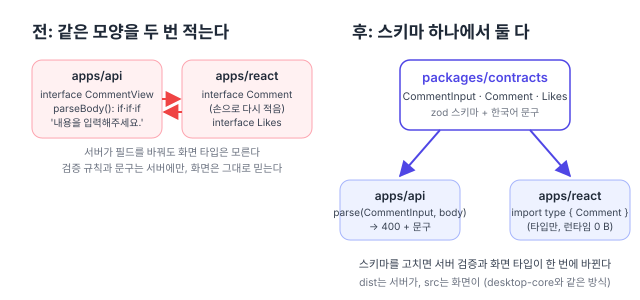

리팩터링 계획([#150](https://github.com/hyeoniverse/MacFolio/issues/150)) 1단계 "타입과 데이터 구조"의 첫 항목. 3단계에서 서버 요청을 [클라이언트 하나](/memo/shared-api-client)로 모았으니, 이제 그 요청과 응답의 **모양**을 한 곳에 둘 차례다.

## 같은 모양을 두 번 적고 있었다

댓글 하나의 모양은 서버 `comments.service.ts`의 `CommentView`와 화면 `commentsApi.ts`의 `Comment`에 각각 적혀 있었다. 필드 열 개가 글자 그대로 같다. 서버가 `likes` 필드를 더했을 때 화면 쪽을 같이 고쳤는지는 사람이 기억해야 했다. 틀려도 타입 검사는 아무 말이 없다. 두 파일이 서로를 모르기 때문이다.

검증도 마찬가지다. "내용은 1~500자"라는 규칙과 "내용을 입력해주세요."라는 문구는 서버 `rules.ts`의 `if`문 안에만 있다. 화면은 그 규칙을 모른 채 보내고, 400이 오면 서버가 준 문구를 그대로 보여 준다. 그래서 글자 수 안내 같은 것을 화면에서 하려면 `500`을 또 적어야 한다.



## contracts 패키지

`packages/contracts`(`@macfolio/contracts`)를 만들고 zod 스키마를 뒀다. 스키마는 값이면서 타입이다.

```ts
// packages/contracts/src/comments.ts
export const CommentInput = requestBody({
	body: z
		.string({ error: '내용을 입력해주세요.' })
		.trim()
		.min(1, '내용을 입력해주세요.')
		.max(COMMENT_BODY_MAX, `내용은 ${COMMENT_BODY_MAX}자까지 입력할 수 있습니다.`),
	turnstileToken: z.string().optional(),
});
export type CommentInput = z.infer<typeof CommentInput>;

export const Comment = z.object({ id: z.string(), name: z.string(), ipPrefix: z.string().nullable() /* … */ });
export type Comment = z.infer<typeof Comment>;
```

**서버**는 `parse(CommentInput, body)`로 검사한다. 돌려주는 모양은 서버가 이미 쓰던 `{ value } | { errors: string[] }` 그대로라, 서비스의 `if ('errors' in parsed) throw new BadRequestException(parsed.errors)`는 한 글자도 안 바뀌었다. `rules.ts`의 `parseBody`는 열 줄짜리 `if`문에서 한 줄이 됐다.

**화면**은 `import type { Comment } from '@macfolio/contracts'`로 타입만 가져온다. `type`만 가져오므로 번들에 zod가 들어가지 않는다(0바이트). 손으로 적은 `interface Comment`·`Likes`·`PostCounts`는 지웠다.

패키지 구조는 `desktop-core`와 같다. 화면은 `source` 조건으로 `src`를 바로 읽고, 서버는 빌드한 `dist`를 쓴다. Dockerfile은 `desktop-core`와 `contracts`를 함께 빌드한다.

## 고른 것과 버린 것

- **zod 4**. 스키마에 문구를 한국어로 적을 수 있고(`.min(1, '…')`), 타입이 추론되고, 서버와 화면이 같은 런타임 없이도 쓸 수 있다. NestJS의 `class-validator`는 데코레이터라 화면에서 쓸 수 없어 고르지 않았다.
- **`requestBody()`**: 몸통이 `null`이나 문자열이면 zod는 "Invalid input: expected object"를 내는데, 사용자가 볼 문구가 아니다. 객체가 아니면 빈 객체로 보고 각 필드의 문구를 내게 한 작은 도우미다. 전에 `parseBody(null)`이 "내용을 입력해주세요."를 돌려주던 동작이 그대로다.
- **응답 스키마도 둔다**. 지금 화면은 응답을 검증하지 않고 타입만 쓴다. 하지만 스키마가 있으니 나중에 `parse(Comment, json)`으로 서버 응답을 확인하는 것이 한 줄이다.
- **한 도메인만**. 댓글·좋아요(요청 1, 응답 3)만 옮겼다. 나머지(글, 메시지, 메일, 배경화면, 파일, 분석 …)는 같은 방식으로 도메인마다 한 PR씩 간다. 처음부터 다 옮기면 PR이 커서 읽을 수 없다.

## 숫자

| 항목                    | 전   | 후                              |
| ----------------------- | ---- | ------------------------------- |
| 댓글 모양이 적힌 곳     | 2    | 1                               |
| `parseBody` 줄 수       | 8    | 1                               |
| 검증 문구가 적힌 곳     | 서버 | contracts (화면도 읽을 수 있다) |
| 화면 번들에 더해진 크기 |      | 0 B (타입만)                    |

다음은 같은 방식으로 글(posts)·메시지·메일을 옮기고, 그다음 `shared/profile.ts`를 나눈다.

#MacFolio #리팩터링 #zod #TypeScript
