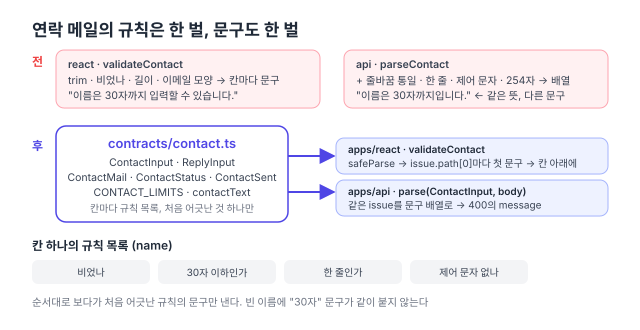

리팩터링 계획([#150](https://github.com/hyeoniverse/MacFolio/issues/150)) 1단계의 넷째 PR. [댓글](/memo/contracts-comments), [글](/memo/contracts-posts), [메시지](/memo/contracts-messages)에 이어 메일 앱의 연락 메일을 옮겼다. 이번에는 응답 모양보다 **입력 검사**가 주인공이다.

## 규칙은 같고 문구가 달랐다

연락 메일의 네 칸(이름·이메일·제목·내용)은 화면 `contact.ts`의 `validateContact`가 칸마다 문구를 돌려주고, 서버 `contact/rules.ts`의 `parseContact`가 같은 규칙으로 다시 본다. 주석에도 "서버도 같은 규칙을 쓴다"고 적혀 있었다. 열어 보니 상한(30·100·2,000자)은 같은데 문구가 달랐다.

| 경우           | 화면                                | 서버                             |
| -------------- | ----------------------------------- | -------------------------------- |
| 이름 30자 초과 | 이름은 30자까지 입력할 수 있습니다. | 이름은 30자까지입니다.           |
| 이메일 비움    | 답장받을 이메일을 입력해주세요.     | 이메일 형식을 확인해주세요.      |
| 제목에 줄바꿈  | (안 본다)                           | 이름과 제목은 한 줄로 써 주세요. |
| 제어 문자      | (안 본다)                           | 읽을 수 없는 글자가 있습니다.    |

화면이 먼저 거르니 사용자가 서버 문구를 볼 일은 거의 없다. 그래서 아무도 몰랐다. 하지만 "같은 규칙"이라는 말은 사람의 기억이었지 코드가 아니었다.



## 칸마다 규칙 목록, 처음 어긋난 것 하나

댓글·글에서는 zod의 `.min()`·`.max()`를 그대로 썼다. 연락 메일은 칸 하나에 규칙이 서너 개(비었나, 길이, 한 줄, 제어 문자)라 조금 다르게 했다. 규칙을 `[검사, 문구]` 목록으로 적고 처음 어긋난 것 하나만 issue로 낸다.

```ts
const field = (rules: [test: (value: string) => boolean, message: string][]) =>
	z.preprocess(contactText, z.string()).superRefine((value, ctx) => {
		const failed = rules.find(([test]) => !test(value));
		if (failed) ctx.addIssue({ code: 'custom', message: failed[1] });
	});

export const ContactInput = requestBody({
	name: field([
		[nonEmpty, '이름을 입력해주세요.'],
		[(v) => v.length <= CONTACT_LIMITS.name, `이름은 ${CONTACT_LIMITS.name}자까지 입력할 수 있습니다.`],
		[oneLine, '이름과 제목은 한 줄로 써 주세요.'],
		[readable, '읽을 수 없는 글자가 있습니다.'],
	]),
	// email, subject, body …
});
```

"하나만"이 중요하다. 화면은 칸 아래에 문구 한 줄을 보이는 자리라 두 개를 받으면 곤란하고, 빈 이름에 "30자까지" 문구까지 붙으면 이상하다. zod의 refine을 여러 개 이어 붙이면 앞의 것이 실패해도 뒤의 것이 다 돈다. 그래서 `superRefine` 하나 안에서 `find`로 끝낸다.

## 같은 issue를 둘이 다르게 쓴다

**화면**의 `validateContact`는 `safeParse` 결과의 issue를 `path[0]`(칸 이름)으로 묶어 칸마다 첫 문구를 고른다. 돌려주는 모양 `{ value, errors: ContactErrors }`는 그대로라 `ComposeView`는 한 글자도 안 바뀌었다. 화면이 서버만 보던 규칙(한 줄, 제어 문자)도 같이 보게 됐다.

**서버**의 `parseContact`는 `parse(ContactInput, input)` 한 줄. 돌려주는 `{ errors: string[] }`가 400의 `message`가 된다. 문구는 화면 것으로 맞췄다. 사용자가 보는 글이니 화면 쪽이 더 친절했다.

관리자 답장(`ReplyInput`)과 응답 모양(`ContactMail`·`ContactSent`·`ContactStatus`)도 함께 옮겼다. 서버 `ContactMailView`, 화면 `ContactMail`·`ContactStatus` 인터페이스는 contracts 타입의 별칭이 됐다.

## 결과

| 항목                     | 전                      | 후                                              |
| ------------------------ | ----------------------- | ----------------------------------------------- |
| 연락 메일 규칙이 적힌 곳 | 2 (화면·서버)           | 1                                               |
| 문구가 다른 경우         | 2                       | 0                                               |
| 화면이 보는 규칙         | 4                       | 6 (한 줄·제어 문자 추가)                        |
| 서버 `rules.ts`          | 검사 60줄 + 메일 만들기 | 메일 만들기만                                   |
| 동작 변화                |                         | 400 문구가 화면 것으로 (e2e는 상태 코드만 본다) |

다음은 배경화면·파일·분석 순으로 같은 방식.

#MacFolio #리팩터링 #zod #TypeScript
