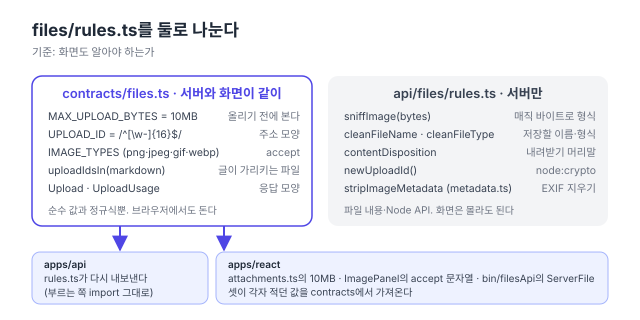

리팩터링 계획([#150](https://github.com/hyeoniverse/MacFolio/issues/150)) 1단계의 여섯째 PR. [댓글](/memo/contracts-comments)·[글](/memo/contracts-posts)·[메시지](/memo/contracts-messages)·[연락 메일](/memo/contracts-contact)·[배경화면](/memo/contracts-wallpapers)에 이어 올린 파일(`/files`)이다. 이번 도메인은 "무엇을 옮기지 않을 것인가"가 더 중요했다.

## 한 파일에 두 종류가 있었다

서버 `files/rules.ts`에는 이런 것이 있었다.

- `MAX_UPLOAD_BYTES = 10MB`, `UPLOAD_ID = /^[\w-]{16}$/`, `IMAGE_TYPES`, `uploadIdsIn(markdown)`
- `sniffImage(bytes)`, `cleanFileName`, `cleanFileType`, `contentDisposition`, `newUploadId()`

앞 줄은 화면도 안다. 편집기는 올리기 전에 10MB를 보고(`attachments.ts`에 같은 숫자가 또 있었다), 이미지 고르기 창은 `accept="image/png,image/jpeg,…"`를 글자로 적어 두었고, 휴지통의 서버 파일 목록은 응답 모양 `ServerFile`을 손으로 적었다. 뒷줄은 화면이 몰라도 된다. 파일 내용을 읽고(매직 바이트), Node의 `crypto`를 쓰고, HTTP 머리말을 만든다.



## 기준: 화면도 알아야 하는가

contracts에 넣는 기준을 "서버와 화면이 같이 쓰는 값·모양"으로 잡았다. 그 기준으로 앞 줄만 옮겼다.

```ts
// packages/contracts/src/files.ts
export const MAX_UPLOAD_BYTES = 10 * 1024 * 1024;
export const UPLOAD_ID = /^[\w-]{16}$/;
export const IMAGE_TYPES: readonly string[] = ['image/png', 'image/jpeg', 'image/gif', 'image/webp'];
export function uploadIdsIn(text: string | null | undefined): string[] {
	/* /files/<16자> */
}

export const Upload = z.object({ id, name, type, size, image, path });
export const UploadUsage = Upload.extend({ createdAt, createdBy, usedBy: { posts, revisions, wallpaper } });
```

전부 순수한 값과 정규식이다. 브라우저에서도 그대로 돈다. `sniffImage`나 `newUploadId`는 옮기지 않았다. 화면이 쓸 일이 없고, Node API에 기대는 것을 contracts에 넣으면 패키지가 브라우저에서 못 돌게 된다.

## 서버 쪽은 다시 내보내기

서버 `rules.ts`는 옮긴 네 개를 contracts에서 다시 내보낸다. `files.service.ts`·`wallpapers.service.ts`·컨트롤러의 import는 한 글자도 안 바뀌었다. 시험도 `uploadIdsIn`의 경우만 contracts로 옮기고 나머지는 그대로다.

화면은 세 곳이 바뀌었다. `attachments.ts`의 `10 * 1024 * 1024`가 contracts 값이 됐고, `ImagePanel.tsx`의 accept 문자열은 `IMAGE_TYPES.join(',')`, 휴지통 `filesApi.ts`의 `ServerFile` 인터페이스는 `UploadUsage`의 별칭이 됐다. 글 편집기가 올린 파일 응답을 읽는 `as Omit<Uploaded, 'url'> & { path: string }`도 `as Upload`로 짧아졌다.

## 결과

| 항목             | 전                        | 후                         |
| ---------------- | ------------------------- | -------------------------- |
| 코드에 적힌 10MB | 2 (서버·화면)             | 1                          |
| 이미지 형식 목록 | 2 (서버 배열·화면 문자열) | 1                          |
| 파일 응답 모양   | 2 (서버·화면)             | 1                          |
| 서버 `rules.ts`  | 9개                       | 5개 (서버만 하는 것)       |
| 동작 변화        |                           | 없음 (e2e 파일 8개 그대로) |

다음은 분석(analytics)과 사이트 프로필. 그러면 손으로 적은 응답 타입이 없어진다.

#MacFolio #리팩터링 #zod #TypeScript
