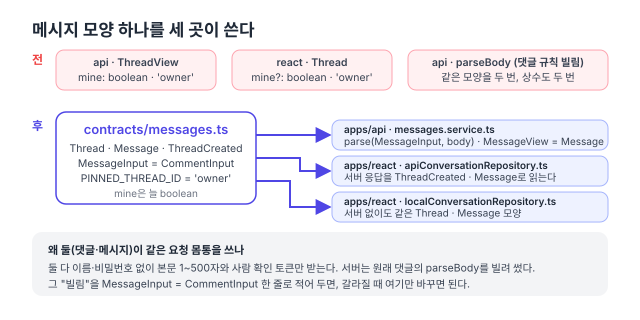

리팩터링 계획([#150](https://github.com/hyeoniverse/MacFolio/issues/150)) 1단계의 셋째 PR. [댓글](/memo/contracts-comments), [글](/memo/contracts-posts)에 이어 메시지 앱의 요청·응답 모양을 `@macfolio/contracts`로 옮겼다.

## 메시지 앱은 저장소가 둘이다

메시지 앱은 서버가 있으면 `/messages`에, 서버가 없으면(로컬 개발, 서버가 죽었을 때) `localStorage`에 저장한다. 둘 다 `ConversationRepository` 인터페이스를 구현하고 화면은 어느 쪽인지 모른다. 그래서 항목(`Thread`)과 말풍선(`Message`)의 모양은 **세 곳**이 맞춰야 한다. 서버가 보내는 것, 서버 저장소가 읽는 것, 로컬 저장소가 만드는 것.

지금까지는 서버 `messages.service.ts`의 `ThreadView`·`MessageView`와 화면 `conversations.ts`의 `Thread`·`Message`가 각자 적혀 있었다. 열어 보니 하나가 달랐다. 화면은 `mine?: boolean`(없어도 됨), 서버는 `mine: boolean`(늘 보냄). 로컬 저장소도 늘 채우고 있어서 실제로 없는 경우는 없었다. 타입만 느슨했고, 아무도 몰랐다.



## 옮긴 것

```ts
// packages/contracts/src/messages.ts
export const PINNED_THREAD_ID = 'owner';

/** 새 피드백·답글 요청 몸통. 댓글과 같은 규칙(1~500자, 사람 확인 토큰) */
export const MessageInput = CommentInput;

export const Thread = z.object({
	id: z.string(),
	title: z.string(),
	ipPrefix: z.string().optional(),
	createdAt: z.string(),
	pinned: z.boolean().optional(),
	mine: z.boolean(),
	summary: z.string().optional(),
	lastMessage: z.object({ text: z.string(), createdAt: z.string() }).optional(),
});
export const ThreadCreated = z.object({ thread: Thread, message: Message });
```

**서버**는 `parse(MessageInput, body)`로 검사하고, `ThreadView`·`MessageView`는 contracts 타입의 별칭이 됐다. 서비스 로직은 그대로다.

**화면**의 `conversations.ts`는 `Thread`·`Message` 인터페이스를 지우고 contracts에서 가져와 다시 내보낸다. 컴포넌트와 로컬 저장소의 import 경로는 그대로라 바뀐 파일이 적다. `mine`이 필수가 되면서 시험 픽스처 하나에 `mine: false`를 더했고, 그게 전부였다.

## 요청 몸통은 댓글과 같다

메시지도 댓글도 이름·비밀번호 없이 본문 1~500자와 사람 확인 토큰만 받는다. 서버는 원래 `comments/rules.ts`의 `parseBody`를 가져다 쓰고 있었다. 메시지 서비스가 댓글 모듈을 알아야 하는 이유가 "검사 함수가 거기 있어서"뿐이었다.

contracts에서는 `MessageInput = CommentInput` 한 줄로 적었다. 같은 규칙이라는 사실은 그대로 두되, 둘이 갈라질 때(예: 메시지는 1,000자까지) 이 줄만 스키마로 바꾸면 된다. 서버 메시지 모듈은 이제 댓글 모듈에서 IP 가리기·해시만 가져온다.

## 고정 항목 id

사이드바 맨 위의 사이트 주인 안내는 id가 `'owner'`다. 서버에는 거기 단 답글만 있고(`threadId`가 빈 글), 안내 글 자체는 화면에 있다. 이 `'owner'`가 서버 `PINNED_THREAD_ID`와 화면 `PINNED_THREAD_ID`에 각각 적혀 있었다. 한쪽이 바꾸면 안내가 사라지는 값이다. contracts에 하나만 두고 양쪽이 다시 내보낸다.

## 결과

| 항목                         | 전                    | 후                           |
| ---------------------------- | --------------------- | ---------------------------- |
| `Thread`·`Message`가 적힌 곳 | 2 (서버·화면)         | 1                            |
| `'owner'` 상수               | 2                     | 1                            |
| `mine` 타입                  | 서버 필수, 화면 선택  | 필수                         |
| 메시지 → 댓글 모듈 의존      | 검사 함수 + IP 도우미 | IP 도우미만                  |
| 동작 변화                    |                       | 없음 (e2e 메시지 4개 그대로) |

다음은 메일(문의)·배경화면·파일·분석 순으로 같은 방식.

#MacFolio #리팩터링 #zod #TypeScript
