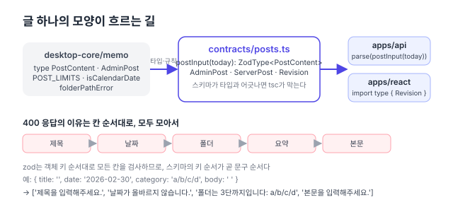

리팩터링 계획([#150](https://github.com/hyeoniverse/MacFolio/issues/150)) 1단계의 둘째 PR. [댓글·좋아요](/memo/contracts-comments)에서 정한 방식을 글(posts)에 적용했다.

## 댓글과 다른 점: 타입이 이미 있다

댓글은 모양이 서버와 화면에 따로 적혀 있어서 contracts에 새로 적으면 됐다. 글은 다르다. `PostContent`·`AdminPost`·`ServerPost` 타입이 이미 `desktop-core/memo`에 있고, 화면의 글 목록 합치기(`mergeAdminPosts`)와 휴지통 계산이 그 타입을 쓴다. contracts에 또 적으면 세 번째 사본이 된다.

그래서 스키마를 **그 타입에 맞춰 선언**했다.

```ts
import type { PostContent as PostContentShape } from '@macfolio/desktop-core/memo';

export const PostContent: z.ZodType<PostContentShape> = z.object({
	title: z.string(),
	date: z.string(),
	category: z.string(),
	summary: z.string(),
	body: z.string(),
});
```

`z.ZodType<PostContentShape>`로 적으면 스키마가 내는 값이 그 타입과 다를 때 tsc가 막는다. 필드를 빼먹거나 `nullable`을 잘못 붙이면 컴파일이 안 된다. 타입의 출처는 desktop-core 한 곳이고, contracts는 "그 타입대로 검사하는 값"만 가진다.



의존 방향은 `contracts → desktop-core` 한쪽이다. 길이 한도(`POST_LIMITS`), 날짜 검사(`isCalendarDate`), 폴더 경로 규칙(`folderPathError`)도 desktop-core에 있던 것을 그대로 가져다 쓴다. 거꾸로 desktop-core가 contracts를 보게 하면 순환이 된다.

## 서버의 if문 스물한 줄

서버 `posts/rules.ts`의 `parsePostInput`은 칸마다 다듬고 검사하는 `if`가 스물한 줄이었다. 날짜가 비면 오늘로, 본문은 뒤 공백만 떼고, 폴더는 비면 "폴더를 골라주세요." 아니면 경로 규칙. 스키마로 옮기면서 동작을 하나도 바꾸지 않으려고 기존 시험(`rules.test.ts`)의 경우를 contracts 시험으로 그대로 옮겨 통과시켰다.

```ts
export const postInput = (today: string): z.ZodType<PostContentShape, unknown> =>
	requestBody({
		title: text()
			.refine((t) => t.length > 0, '제목을 입력해주세요.')
			.refine(/* 100자 */),
		date: text()
			.transform((d) => d || today)
			.refine(isCalendarDate, '날짜가 올바르지 않습니다.'),
		category: text().superRefine((c, ctx) => {
			/* 비면 '폴더를 골라주세요.', 아니면 folderPathError */
		}),
		summary: text().refine(/* 200자 */),
		body: z
			.preprocess((v) => (typeof v === 'string' ? v.replace(/\s+$/, '') : ''), z.string())
			.refine(/* 비었는지, 50,000자 */),
	});
```

`today`를 인자로 받는 함수인 이유는 "날짜가 비면 오늘"의 오늘이 서버 시간(서울)이기 때문이다. 스키마를 모듈 로드 시점에 한 번 만들면 그날 날짜가 박힌다.

**이유의 순서.** 원래 코드는 제목 → 날짜 → 폴더 → 요약 → 본문 순서로 이유를 모았고 e2e가 그 순서를 본다. zod는 객체의 키 순서대로 모든 칸을 검사하므로, 스키마의 키를 그 순서로 적으면 같은 배열이 나온다. 별도 정렬 코드가 없다.

**문자열이 아닌 칸.** 원래 코드는 `typeof raw[key] === 'string'`이 아니면 빈 문자열로 봤다(숫자 날짜 `20260929`를 보내면 "날짜가 올바르지 않습니다"가 아니라 오늘). `z.string()`은 숫자에 "expected string"을 내므로, 앞에 `z.preprocess`로 빈 문자열로 바꾸는 `text()` 도우미를 뒀다. 사소하지만 동작이 바뀌지 않게 하려면 이런 것까지 맞춰야 한다.

## 덤으로 맞춘 것

`AdminPost.deletedAt`이 desktop-core에서는 `?: string | null`, 서버에서는 `string | null`이었다. 서버는 늘 보내는데 화면 타입은 없을 수도 있다고 했던 것이다. 스키마를 하나로 두니 바로 드러나서 `string | null`로 맞췄다. 시험 픽스처 한 곳에 `deletedAt: null`을 더한 것이 전부다.

## 숫자

| 항목                        | 전            | 후                                      |
| --------------------------- | ------------- | --------------------------------------- |
| 서버 `parsePostInput`       | 21줄          | 1줄 (스키마는 contracts)                |
| `RevisionSummary`가 적힌 곳 | 2 (서버·화면) | 1                                       |
| `AdminPost.deletedAt` 타입  | 2가지         | 1가지                                   |
| 동작 변화                   |               | 없음 (e2e 글 15개·메모 정리 4개 그대로) |

다음은 메시지·메일·배경화면·파일·분석 순으로 같은 방식.

#MacFolio #리팩터링 #zod #TypeScript
