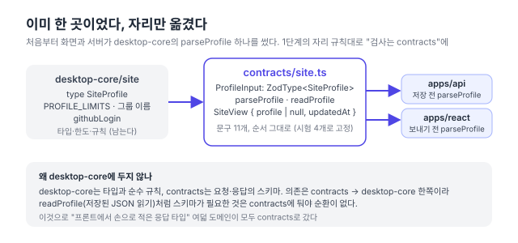

리팩터링 계획([#150](https://github.com/hyeoniverse/MacFolio/issues/150)) 1단계의 여덟째, 마지막 도메인. 댓글·글·메시지·연락 메일·배경화면·파일·[분석](/memo/contracts-analytics)에 이어 사이트 프로필이다.

## 이미 한 곳이었다

사이트 프로필(이름·직무·GitHub·기술 목록)은 관리자가 시스템 설정에서 고치고 서버에 저장한다. 이 도메인은 다른 일곱과 달랐다. 검사 함수 `parseProfile`이 처음부터 `@macfolio/desktop-core/site`에 있어서, 화면은 보내기 전에, 서버는 저장하기 전에 같은 함수를 불렀다. "같은 규칙"이 주석이 아니라 코드였다.

그래도 옮겼다. 일곱 도메인을 거치며 자리가 정해졌기 때문이다. **타입과 순수 규칙은 desktop-core, 요청·응답의 스키마는 contracts.** 프로필만 desktop-core에 검사가 남아 있으면 다음 사람이 "검사는 어디에 쓰지?"를 두 군데에서 찾는다.



## 옮기면서 지킨 것

`parseProfile`은 `if`문으로 된 58줄이었다. 칸마다 "글자여야 합니다 → 입력해 주세요 → 80자까지 → 쓸 수 없는 글자" 순으로 처음 어긋난 것 하나, 기술 목록은 "목록이어야 → 항목은 글자 → 20개까지 → 40자·한 줄" 순으로 여럿. 문구 열한 개가 있고 e2e 시험이 그중 둘의 순서를 본다.

zod로 옮길 때 이 문구와 순서를 그대로 지켰다. 칸마다 `z.unknown().optional().transform((raw, ctx) => …)`로 원래 함수를 거의 그대로 넣었고, 스키마의 키 순서가 곧 이유의 순서다. 예전 desktop-core 시험 세 개를 contracts로 옮기고, e2e가 보던 `['이름을(를) 입력해 주세요.', '이메일 주소가 올바르지 않습니다.']`도 contracts 시험에 넣었다.

```ts
// packages/contracts/src/site.ts
export const ProfileInput: z.ZodType<SiteProfile, unknown> = z.object(
	{
		name: text('이름', true),
		// nameEn, role, school, location …
		github: text('GitHub 주소', true)
			.refine(
				(github) => !github || githubLogin({ github }) !== '',
				'GitHub 주소는 https://github.com/아이디 모양이어야 합니다.'
			)
			.transform((github) => github.replace(/\/$/, '')),
		email: text('이메일', true).refine((email) => !email || EMAIL.test(email), '이메일 주소가 올바르지 않습니다.'),
		skills: z.object(
			{ frontend: list('프론트엔드 기술') /* … */ },
			{ error: '기술은 묶음(frontend·backend·interaction)이어야 합니다.' }
		),
		siteStack: list('이 사이트를 만든 기술'),
	},
	{ error: '프로필을 보내 주세요.' }
);
```

`z.ZodType<SiteProfile>`로 선언해 스키마가 내는 값이 desktop-core 타입과 다르면 tsc가 막는다. [글 도메인](/memo/contracts-posts)에서 쓴 방식 그대로다.

한 가지 걸린 것. `z.unknown().transform()`을 객체 키에 그대로 쓰면 키가 없을 때 zod가 "expected nonoptional"을 낸다. `.optional()`을 끼워 "없는 키는 undefined로 받아 내가 처리한다"고 알려야 한다.

## desktop-core에 두지 않는 이유

`readProfile`(DB에 저장된 JSON을 읽을 때 규칙에 맞으면 그 값, 아니면 `null`)은 `parseProfile`을 부른다. 스키마가 contracts로 가면 `readProfile`도 따라가야 한다. desktop-core가 contracts를 부르면 순환이다 (contracts → desktop-core → contracts). 의존은 한쪽이어야 하고, 그러면 "스키마가 필요한 것"은 모두 contracts 쪽에 있어야 한다.

desktop-core에는 `SiteProfile` 타입, `PROFILE_LIMITS`, `SKILL_GROUPS`, `githubLogin`이 남는다. 화면의 입력 칸 `maxLength`와 설정 화면이 쓰는 것들이다.

## 1단계 둘째 항목 끝

| 도메인    | PR                                                       | 옮긴 것                                    |
| --------- | -------------------------------------------------------- | ------------------------------------------ |
| 댓글      | [#200](https://github.com/hyeoniverse/MacFolio/pull/200) | 패키지 자체, CommentInput·Comment          |
| 글        | [#201](https://github.com/hyeoniverse/MacFolio/pull/201) | postInput(today), desktop-core 타입에 고정 |
| 메시지    | [#202](https://github.com/hyeoniverse/MacFolio/pull/202) | Thread·Message, 로컬 저장소까지 같은 모양  |
| 연락 메일 | [#203](https://github.com/hyeoniverse/MacFolio/pull/203) | 화면·서버의 다른 문구를 하나로             |
| 배경화면  | [#204](https://github.com/hyeoniverse/MacFolio/pull/204) | 세 곳의 40                                 |
| 파일      | [#205](https://github.com/hyeoniverse/MacFolio/pull/205) | "화면도 알아야 하는가"로 나누기            |
| 분석      | [#206](https://github.com/hyeoniverse/MacFolio/pull/206) | 보내는 쪽·받는 쪽·읽는 쪽                  |
| 프로필    | 이 글                                                    | 자리 정리, 문구·순서 고정                  |

프론트에서 손으로 적은 응답 타입이 없어졌다. 남은 1단계는 `shared/profile.ts` 나누기와 유니언·브랜드 타입.

#MacFolio #리팩터링 #zod #TypeScript
