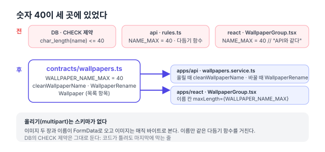

리팩터링 계획([#150](https://github.com/hyeoniverse/MacFolio/issues/150)) 1단계의 다섯째 PR. [댓글](/memo/contracts-comments)·[글](/memo/contracts-posts)·[메시지](/memo/contracts-messages)·[연락 메일](/memo/contracts-contact)에 이어 배경화면이다. 작은 도메인이라 금방 끝났지만, 작아서 보이는 것이 있었다.

## 40이 세 번

관리자가 더한 배경화면의 이름은 40자까지다. 이 숫자가 세 곳에 있었다.

- DB: `CHECK (char_length(name) <= 40)`
- 서버 `wallpapers/rules.ts`: `NAME_MAX = 40`과 `cleanWallpaperName` (확장자·제어 문자를 빼고 40자까지)
- 화면 `WallpaperGroup.tsx`: `const NAME_MAX = 40` 위에 주석 "이름 칸과 같은 한도 (API의 NAME_MAX)"

주석이 "같다"고 말할 뿐 아무것도 그것을 지키지 않았다. 서버가 50으로 올리면 화면 이름 칸은 40에서 더 못 친다. 반대로 화면이 올리면 서버가 자르는데 사용자는 모른다.



## 옮긴 것

```ts
// packages/contracts/src/wallpapers.ts
export const WALLPAPER_NAME_MAX = 40;
export function cleanWallpaperName(name: unknown): string | null {
	/* 확장자·제어 문자 제거, 40자 */
}

export const WallpaperRename = requestBody({
	name: z.preprocess(cleanWallpaperName, z.string({ error: '이름을 입력해 주세요.' })),
});
export const Wallpaper = z.object({ id, name, image, thumbnail, createdAt });
```

`WallpaperRename`은 전처리에서 이름을 다듬고, 다듬은 결과가 `null`(빈 이름)이면 `z.string()`이 거절한다. 거절 문구는 서버가 원래 내던 "이름을 입력해 주세요."다. 서버 `rules.ts`와 그 시험은 지우고 contracts로 옮겼다. 화면은 `const NAME_MAX = 40` 대신 `WALLPAPER_NAME_MAX`를 가져온다.

## 올리기는 스키마가 없다

배경화면 올리기는 JSON이 아니다. 이미지 두 장(원본·썸네일)과 이름이 `FormData`로 오고, 이미지는 확장자가 아니라 매직 바이트로 본다. zod 스키마로 적을 몸통이 없다. 이름만 같은 `cleanWallpaperName`을 거친다. "모든 요청을 스키마로"가 목표가 아니라 "같은 규칙은 한 곳에"가 목표라서, 여기서는 함수 하나를 공유하는 것으로 충분하다.

DB의 CHECK 제약은 그대로 뒀다. 코드가 틀려도 마지막에 막는 줄이고, 그 숫자는 마이그레이션에 박혀 있어 contracts가 가져다 쓸 수 없다. 대신 contracts 시험이 "50자를 넣으면 40자"를 고정하고, API e2e가 그 값으로 저장되는 것을 본다.

## 결과

| 항목                                        | 전            | 후                    |
| ------------------------------------------- | ------------- | --------------------- |
| 코드에 적힌 40                              | 2 (서버·화면) | 1                     |
| 서버 `wallpapers/rules.ts`                  | 함수 + 시험   | 없음 (contracts로)    |
| 서버 `WallpaperView`·화면 `ServerWallpaper` | 각자          | contracts `Wallpaper` |
| 동작 변화                                   |               | 없음 (e2e 6개 그대로) |

다음은 파일·분석 순으로 같은 방식.

#MacFolio #리팩터링 #zod #TypeScript
