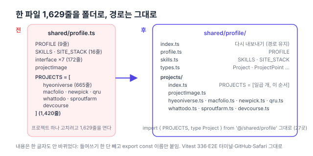

리팩터링 계획([#150](https://github.com/hyeoniverse/MacFolio/issues/150)) 1단계의 셋째 항목. [여덟 도메인의 응답 타입](/memo/contracts-site)을 contracts로 옮긴 다음이다.

## 무엇이 한 파일에 있었나

`apps/react/src/shared/profile.ts`는 사이트 주인의 프로필과 프로젝트의 "단일 출처"다. GitHub 앱의 스냅샷, 터미널의 `projects` 명령, Safari 탭, Finder의 프로젝트 폴더가 모두 여기를 읽는다. 단일 출처라는 생각은 맞았다. 문제는 그 단일 출처가 한 파일이었다는 것이다.

| 내용                       | 줄    |
| -------------------------- | ----- |
| `PROFILE` (이름·직무·주소) | 9     |
| `SKILLS`·`SITE_STACK`      | 16    |
| 인터페이스 일곱 개         | 172   |
| `PROJECTS` 일곱 개         | 1,420 |

HYEONIVERSE 하나가 665줄이다. 프로젝트 페이지의 장(chapter), 갤러리, 크레딧, 타임라인이 다 여기 들어 있어서다. SproutFarm의 조작법 한 줄을 고치려면 1,629줄짜리 파일을 열고 1,421번째 줄로 가야 했다.



## 어떻게 나눴나

```
shared/profile/
  index.ts          ← PROFILE, SKILLS, SITE_STACK, 타입, PROJECTS를 다시 내보낸다
  profile.ts        ← PROFILE
  skills.ts         ← SKILLS, SITE_STACK
  types.ts          ← Project, ProjectPoint, ProjectChapter, ThemeSwatch …
  projects/
    index.ts        ← PROJECTS = [HYEONIVERSE, MACFOLIO, …] (이 순서가 곧 화면의 순서)
    projectImage.ts ← 그림 주소 도우미
    hyeoniverse.ts  ← export const HYEONIVERSE: Project = { … }
    macfolio.ts, newpick.ts, qru.ts, whattodo.ts, sproutfarm.ts, devcourse.ts
```

내용은 한 글자도 안 바꿨다. 스크립트로 `PROJECTS` 배열의 원소를 하나씩 잘라 들여쓰기 한 단을 빼고 `export const 이름: Project =`를 붙였을 뿐이다. 순서를 정하는 곳은 `projects/index.ts` 한 줄이라, 프로젝트를 더하거나 빼는 일은 "파일 하나 만들고 그 줄에 넣기"가 됐다.

## 경로는 그대로

파일 `shared/profile.ts`를 지우고 폴더 `shared/profile/`에 `index.ts`를 두면 `'@/shared/profile'`은 그 `index.ts`로 간다. 바깥에서 가져오는 27곳(`import { PROJECTS, type Project } from '@/shared/profile'`)과 `vite.config.ts`는 하나도 안 고쳤다. 이슈에 "바깥 import 경로는 유지"라고 적어 둔 그대로다.

## 확인

바꾼 게 없음을 확인하는 일이 전부였다. `tsc`, eslint, Vitest 336개, `pnpm cycles`(새 폴더 안에서 `projects/index.ts` → 각 프로젝트 → `../types`로 한 방향), 그리고 PROJECTS를 읽는 터미널·GitHub·Safari의 Playwright E2E.

| 항목                  | 전          | 후                                   |
| --------------------- | ----------- | ------------------------------------ |
| `shared/profile` 파일 | 1 (1,629줄) | 12 (가장 큰 것 hyeoniverse.ts 668줄) |
| 바깥 import 경로      | 27곳        | 27곳 그대로                          |
| 내용 변화             |             | 없음                                 |

남은 1단계는 유니언·브랜드 타입 하나.

#MacFolio #리팩터링 #TypeScript
