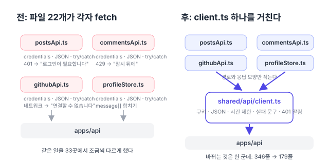
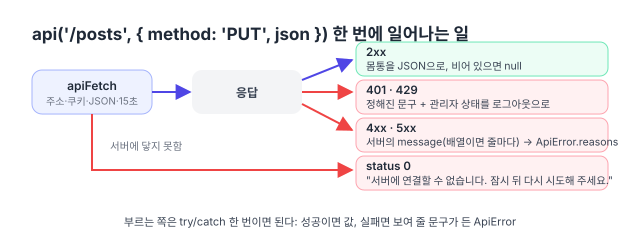

리팩터링 계획([#150](https://github.com/hyeoniverse/MacFolio/issues/150)) 3단계 "공통 기반 코드"의 첫 항목.

## 무엇이 흩어져 있었나

서버(apps/api)를 부르는 파일을 세어 보니 22개, `credentials: 'include'`가 33곳이었다. 하나하나는 짧지만 모두 같은 일을 조금씩 다르게 했다.

- 네트워크 실패 문구가 네 가지: "서버에 연결할 수 없습니다.", "서버에 연결하지 못했습니다.", "…잠시 뒤 다시 시도해 주세요." 붙은 것과 안 붙은 것
- 401 문구가 두 가지: "관리자 로그인이 필요합니다."와 "관리자 로그인이 끝났습니다. 다시 로그인해 주세요."
- 서버가 주는 `message`가 문자열일 때와 배열일 때를 파일마다 따로 처리 (`join(' ')`, `[0]`, 그대로 배열)
- 시간 제한이 5초·10초·15초·20초, 없는 곳도 많았다
- 세션이 끝났을 때: 글 저장은 401을 받아도 화면은 여전히 로그인한 것처럼 보였다. 상태를 바꾸는 코드는 만료 시각 타이머뿐이었다



## client.ts가 하는 일

`shared/api/client.ts`에 두 함수를 뒀다.

| 함수                      | 쓰는 때                                       | 실패하면                                      |
| ------------------------- | --------------------------------------------- | --------------------------------------------- |
| `api<T>(path, options)`   | JSON을 받을 때 (대부분)                       | `ApiError` (status, reasons, 첫 줄이 message) |
| `apiFetch(path, options)` | 상태 코드로 분기할 때 (403은 "내 것 아님" 등) | 서버에 닿지 못했을 때만 `ApiError(0)`         |

옵션은 `method`, `json`(JSON 머리말과 함께), `body`(FormData 그대로), `timeout`(기본 15초, 0이면 없음), `fallback`(서버가 이유를 안 줬을 때 문구). 주소는 `env.apiUrl`, 쿠키는 언제나 함께 보낸다.



실패 문구는 세 상수로 정했다. `UNREACHABLE`(닿지 못함), `SIGNED_OUT`(401), `TOO_MANY`(429). 서버가 검증 오류를 배열로 주면 `ApiError.reasons`에 줄마다 들어가고, 화면은 `reasonsFrom(error)`로 그대로 보여 준다.

```ts
// 전 (postsApi.ts)
async function reasons(response: Response): Promise<string[]> {
	if (response.status === 401) return ['관리자 로그인이 끝났습니다. 다시 로그인해 주세요.'];
	const body = (await response.json().catch(() => ({}))) as { message?: string | string[] };
	return Array.isArray(body.message) ? body.message : [body.message ?? '저장하지 못했습니다.'];
}
async function send(fetchImpl, url, method, body) {
	try {
		const response = await fetchImpl(url, { method, credentials: 'include', ...(body !== undefined && { headers: …, body: JSON.stringify(body) }) });
		if (!response.ok) return { ok: false, errors: await reasons(response) };
		const text = await response.text();
		return { ok: true, body: text ? JSON.parse(text) : null };
	} catch {
		return { ok: false, errors: ['서버에 연결할 수 없습니다.'] };
	}
}

// 후
async function send(fetchImpl, apiUrl, path, method, json) {
	try {
		return { ok: true, body: await api(path, { method, json, apiUrl, fetchImpl, fallback: '저장하지 못했습니다.' }) };
	} catch (error) {
		return { ok: false, errors: reasonsFrom(error) };
	}
}
```

## 401을 한 곳에서 받는다

`onUnauthorized(handler)`를 두고 `adminStore`가 등록한다. 어떤 요청이든 401을 받으면 `refreshAdmin()`을 불러 `/auth/me`로 다시 묻고, 화면이 로그아웃된 상태로 바뀐다. 전에는 만료 시각 타이머만 있어서, 서버에서 세션을 지웠거나 쿠키가 사라졌을 때는 저장이 실패한 뒤에도 관리자 메뉴가 그대로 보였다.

`adminStore → client`로 한 방향이다. client가 adminStore를 알면 순환이 생기므로, client는 핸들러 집합만 들고 있다.

## 그대로 둔 것

- 날씨(Open-Meteo), 효과음 파일, 글의 이미지 내려받기: 우리 서버가 아니라서 쿠키·실패 문구 규칙이 다르다
- `/health` 확인(`serverStatus.ts`): CORS로 막힌 것과 꺼진 것을 가르려고 `no-cors`로 한 번 더 보내는 특수한 흐름
- 분석 이벤트 보내기: `sendBeacon`이 먼저고 fetch는 `keepalive` 대안이라 클라이언트에 넣으면 오히려 복잡하다
- 시험이 넣어 주던 `fetchImpl` 인자: 모듈 서명은 그대로 두고 옵션으로 넘긴다. 시험 쪽은 요청 모양을 `objectContaining`으로 느슨하게 맞췄다 (이제 `signal`·`headers`가 늘 붙으므로)

## 숫자

| 항목                         | 전  | 후  |
| ---------------------------- | --- | --- |
| `credentials: 'include'`     | 33  | 3   |
| 서버를 직접 `fetch`하는 파일 | 22  | 3   |
| 바뀐 파일의 줄 수            | 346 | 179 |
| 네트워크 실패 문구 종류      | 4   | 1   |

다음은 같은 단계의 `localStorage` 접근과 화면 크기 판단(`useIsMobile`·`useViewport`) 통일.

#MacFolio #리팩터링 #React #fetch
