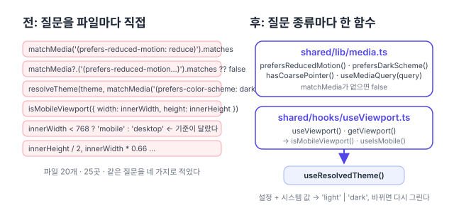

리팩터링 계획([#150](https://github.com/hyeoniverse/MacFolio/issues/150)) 3단계의 마지막 항목. 앞의 둘은 [공통 API 클라이언트](/memo/shared-api-client)와 [브라우저 저장소](/memo/shared-storage)였다.

## 무엇이 흩어져 있었나

`useIsMobile`·`useViewport` 훅이 이미 있는데도 `window.matchMedia`·`innerWidth`를 직접 쓰는 곳이 25곳이었다. 세어 보니 질문은 네 종류뿐이다.

| 질문             | 곳  | 적힌 모양                                                                                        |
| ---------------- | --- | ------------------------------------------------------------------------------------------------ |
| 움직임 줄이기    | 9   | `matchMedia('…').matches`, `matchMedia?.('…').matches ?? false`, 파일마다 다른 상수 이름         |
| 어두운 화면 모드 | 5   | `resolveTheme(theme, matchMedia('(prefers-color-scheme: dark)').matches)`를 세 컴포넌트가 똑같이 |
| 모바일 화면인가  | 4   | `isMobileViewport({ width: innerWidth, height: innerHeight })` 셋, `innerWidth < 768` 하나       |
| 창 크기 숫자     | 7   | 팝오버 자리, 스크롤 연출의 기준선, 앱 전환 카드 간격                                             |

두 가지가 눈에 띄었다. 첫째, 움직임 줄이기를 `?.`로 막는 곳과 안 막는 곳이 섞여 있었다. `matchMedia`가 없는 환경(시험, 옛 브라우저)에서 한쪽은 false, 한쪽은 예외다. 둘째, 분석 이벤트의 `device`가 `innerWidth < 768`로 따로 정해져 있어, 가로로 눕힌 휴대폰(넓지만 낮은 화면)이 셸은 모바일인데 통계는 데스크톱으로 잡혔다.



## 두 모듈

**`shared/lib/media.ts`**: `matchMedia` 질문을 이름 붙인 함수로. `prefersReducedMotion()`, `prefersDarkScheme()`, `hasCoarsePointer()`. 바뀌는 것을 따라가야 하면 `useMediaQuery(query)`(렌더링)나 `onMediaChange(query, cb)`(스토어). `matchMedia`가 없으면 모두 false라서 부르는 쪽에 `?.`가 필요 없다.

**`shared/hooks/useViewport.ts`**: 훅만 있던 곳에 `getViewport()`를 더했다. 이벤트 처리나 스토어 초기화처럼 훅을 쓸 수 없는 자리에서 쓴다. 모바일 여부는 전과 같이 `isMobileViewport(getViewport())` 한 줄이고, 분석도 이 기준을 쓴다.

```ts
// 전 (Finder.tsx, Github.tsx, MobileShell.tsx가 똑같이)
const { theme } = useSettings();
const dark = resolveTheme(theme, window.matchMedia('(prefers-color-scheme: dark)').matches) === 'dark';

// 후
const dark = useResolvedTheme() === 'dark';
```

`useResolvedTheme()`는 `settingsStore`에 뒀다. 설정의 테마와 시스템의 어두운 모드를 합쳐 `'light' | 'dark'`를 돌려주고, 둘 중 하나가 바뀌면 다시 렌더링한다. 전에는 시스템 모드가 바뀌어도 `<html data-theme>`만 바뀌고 이 세 컴포넌트는 다음 렌더링까지 옛 값을 들고 있었다.

## 그대로 둔 것

`WebFrame`이 iframe 안 문서의 `view.innerWidth`를 읽는 한 곳. 우리 창이 아니라 iframe의 창이라 `getViewport()`가 답할 수 없다.

## 숫자

| 항목                                       | 전  | 후                                     |
| ------------------------------------------ | --- | -------------------------------------- |
| `matchMedia`·`innerWidth`를 직접 쓰는 파일 | 20  | 3 (media.ts, useViewport.ts, WebFrame) |
| 움직임 줄이기 질문의 표기                  | 4   | 1                                      |
| 모바일 판단 기준                           | 2   | 1                                      |

이것으로 3단계(공통 기반 코드)가 끝났다. 다음은 1단계, API 요청·응답 타입을 zod 스키마로 모으는 일.

#MacFolio #리팩터링 #React #matchMedia
