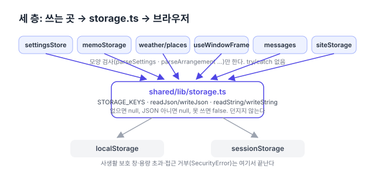

리팩터링 계획([#150](https://github.com/hyeoniverse/MacFolio/issues/150)) 3단계의 둘째 항목. 첫째는 [공통 API 클라이언트](/memo/shared-api-client)였다.

## 무엇이 흩어져 있었나

브라우저에 남기는 값은 일곱 가지다. 설정, 메모 보기 설정과 최근 검색어, 날씨 장소와 단위, 창 위치, 서버 없이 쓴 메시지, 로그인하러 떠날 때 켜 둔 앱. 이것을 다루는 파일 일곱 개가 모두 같은 다섯 줄을 들고 있었다.

```ts
try {
	return JSON.parse(localStorage.getItem(KEY) ?? 'null');
} catch {
	return null;
}
```

쓰는 쪽도 마찬가지로 `try { localStorage.setItem(…) } catch { /* 저장하지 못해도 … */ }`가 파일마다 있었다. try/catch가 열두 개. 주석도 "저장하지 못해도 이번에는 그대로 보인다"가 여섯 가지 표현으로 흩어져 있었다.

왜 try/catch가 필요한가. Safari의 사생활 보호 창은 `localStorage.setItem`에서 `QuotaExceededError`를 던지고, 일부 설정에서는 `localStorage`에 손대는 순간 `SecurityError`가 난다. 그래서 저장은 늘 "되면 좋고 안 돼도 화면은 그대로"여야 한다. 그 규칙이 한 곳에 있지 않으니, 새 키를 더할 때마다 다섯 줄을 다시 베껴 썼다.



## storage.ts

`shared/lib/storage.ts`에 두 가지를 뒀다.

**키 목록** `STORAGE_KEYS`. 문자열 아홉 개가 파일 여섯 개에 흩어져 있던 것을 한 객체로 모았다. 창 위치처럼 앱 이름이 붙는 키는 함수다.

```ts
export const STORAGE_KEYS = {
	settings: 'macfolio:settings',
	memoArrangement: 'macfolio:memo:arrangement',
	weatherPlaces: 'macfolio:weather:places',
	appsBeforeLeaving: 'macfolio:apps-before-leaving', // sessionStorage
	window: (appName: string) => `macfolio:window:${appName}`,
	// …
} as const;
```

**읽고 쓰는 함수** 네 개. `readJson`은 없거나 JSON이 아니면 `null`, `writeJson`은 못 쓰면 `false`. `readString`·`writeString`은 문자열 그대로(기온 단위 `'c'`·`'f'`, 방문자 id). 둘째 인자로 `'session'`을 주면 `sessionStorage`. 한 번만 쓰는 값을 읽고 바로 지우는 `takeJson`도 있다.

부르는 쪽에는 **모양 검사**만 남는다. 저장된 JSON이 지금 코드가 기대하는 모양인지는 저장소가 알 수 없으므로, 그것은 원래대로 `parseSettings`·`parseArrangement` 같은 순수 함수가 한다.

```ts
// 전 (settingsStore.ts)
function load(): Settings {
	try {
		return parseSettings(JSON.parse(localStorage.getItem(SETTINGS_STORAGE_KEY) ?? 'null'));
	} catch {
		return parseSettings(null);
	}
}
export const settingsStore = createStore<Settings>(load());

// 후
export const settingsStore = createStore<Settings>(parseSettings(readJson(STORAGE_KEYS.settings)));
```

## 휴지통의 '내 브라우저 데이터'와 맞물리기

휴지통 앱에는 이 사이트가 브라우저에 남긴 것을 보여 주고 지우는 화면이 있다(`bin/siteStorage.ts`). 그 목록 `BROWSER_DATA`도 키 문자열을 따로 적고 있었는데, 이제 `STORAGE_KEYS`를 가리킨다. 코드 어딘가에 `'macfolio:…'` 키가 새로 생기면 `BROWSER_DATA`에 빠졌다고 알려 주는 시험은 그대로 둔다. 키가 한 파일에 모였으니 시험이 볼 곳도 사실상 하나다.

`public/theme-boot.js`만 예외다. React가 뜨기 전에 테마를 읽어 깜빡임을 막는 다섯 줄짜리 스크립트라 모듈을 가져올 수 없고, 키를 글자 그대로 적는다. `STORAGE_KEYS.settings` 옆에 그렇게 주석을 달았다.

## 숫자

| 항목                              | 전  | 후                 |
| --------------------------------- | --- | ------------------ |
| `localStorage`를 직접 만지는 파일 | 7   | 1                  |
| try/catch                         | 12  | 4 (storage.ts 안)  |
| 키 문자열이 적힌 파일             | 6   | 1 (+theme-boot.js) |
| 바뀐 파일의 줄 수                 | 134 | 53                 |

다음은 같은 단계의 마지막, 화면 크기 판단(`matchMedia`·`innerWidth` 25곳)을 `useIsMobile`·`useViewport`로 통일.

#MacFolio #리팩터링 #React #localStorage
