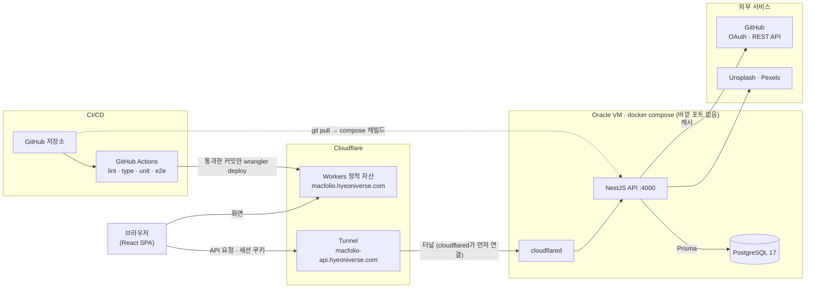
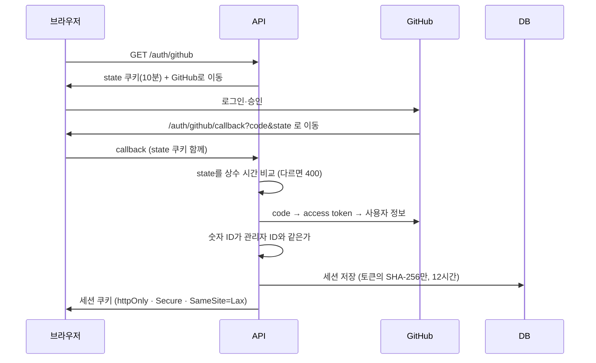
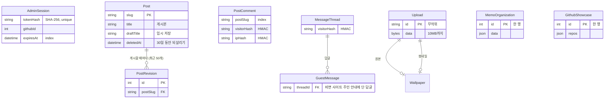

# 백엔드 설계

MacFolio API 서버(`apps/api`)의 구성과 설계 결정을 정리한 문서입니다. 배포 순서는 [deployment.md](deployment.md)에, 기술을 고른 이유는 [README](../README.md#백엔드)에 있습니다.

| 항목        | 값                                                                                               |
| ----------- | ------------------------------------------------------------------------------------------------ |
| 런타임      | Node 22, NestJS, Prisma 7, PostgreSQL 17                                                         |
| 기능 모듈   | 11개: auth, posts, comments, memo, messages, visitors, files, images, wallpapers, github, health |
| 데이터 모델 | 10개, 마이그레이션 12개 (`apps/api/prisma`)                                                      |
| 시험        | 단위·e2e 120개 이상 (e2e는 실제 PostgreSQL)                                                      |
| 운영        | Oracle Cloud VM 한 대, Docker Compose, Cloudflare Tunnel (바깥에 연 포트 없음)                   |

## 구성도

- **같은 사이트, 다른 하위 도메인**: 프론트엔드와 API를 `hyeoniverse.com` 아래에 둬서 `SameSite=Lax` 세션 쿠키가 함께 갑니다. API를 `*.workers.dev`나 IP 주소로 두면 로그인이 되지 않습니다.
- **들어오는 문이 없는 서버**: `cloudflared`가 Cloudflare로 나가는 연결을 열고, 요청은 그 연결로만 들어옵니다. 방화벽에 80·443을 열지 않고, 인증서도 Cloudflare가 맡습니다. compose에는 `ports`가 하나도 없어서 DB는 컨테이너 네트워크 밖에서 보이지 않습니다.
- **검사 뒤에 배포**: 프론트엔드는 main에서 `check`(실제 PostgreSQL로 도는 API e2e와 브라우저 E2E 포함)를 통과한 커밋만 Workers에 올라갑니다. API는 서버에서 `git pull` 후 다시 빌드하고, 시작할 때 `prisma migrate deploy`로 마이그레이션을 적용합니다.

## 요청이 지나가는 길

모든 요청은 같은 층을 차례로 지납니다 (`app.setup.ts`).

| 층               | 하는 일                                                                                                            |
| ---------------- | ------------------------------------------------------------------------------------------------------------------ |
| `trust proxy`    | 터널 뒤에서 실제 방문자 IP를 읽습니다 (요청 제한과 IP 기록에 씁니다)                                               |
| helmet           | 보안 헤더                                                                                                          |
| CORS             | 사이트 주소만 허용, 쿠키 포함                                                                                      |
| `ValidationPipe` | DTO로 모든 입력을 검사하고, 정해 두지 않은 필드가 있으면 거절합니다 (`forbidNonWhitelisted`)                       |
| `AdminGuard`     | 관리자 전용 경로에서 요청마다 세션 쿠키를 DB에서 확인합니다                                                        |
| `ThrottlerGuard` | 로그인과 댓글·메시지 쓰기에 IP마다 1분 단위 제한을 따로 겁니다                                                     |
| 전역 예외 필터   | 에러 모양을 하나로 맞추고, 너무 큰 몸통·깨진 JSON은 413·400으로, 예상하지 못한 에러는 내용을 감춘 500으로 답합니다 |
| `SafeLogger`     | 모든 로그에서 DB 비밀번호·API 키·쿠키·메일 주소를 가립니다 (`common/redact.ts`)                                    |

## 모듈과 권한

읽기는 누구나, 쓰기는 관리자만이 기본입니다. 쓰기 경로에는 모두 요청 제한(`@RateLimit`, IP·경로마다 1분 횟수)을 걸고, 방문자가 쓰는 곳(댓글, 메시지, 메일)은 방문자 쿠키로 주인을 가립니다. 경로 목록과 권한·제한은 `test/routes.e2e.test.ts`의 표가 고정합니다.

| 모듈       | 경로                                                                         | 누구                                  |
| ---------- | ---------------------------------------------------------------------------- | ------------------------------------- |
| auth       | `GET /auth/github`, `/auth/github/callback`, `/auth/me`, `POST /auth/logout` | 로그인은 요청 제한, `me`는 관리자     |
| posts      | `GET /posts` / 임시 저장·게시·버전·되살리기·지우기                           | 읽기는 누구나, 나머지는 관리자        |
| comments   | `GET·POST /posts/:slug/comments`, `DELETE /comments/:id`                     | 방문자 (요청 제한, 자기 댓글만 지움)  |
| messages   | `GET·POST /messages/threads`, `DELETE /messages/:id`                         | 방문자 (요청 제한, 자기 글만 지움)    |
| visitors   | `GET /visitor`                                                               | 방문자 쿠키를 주고 이름을 알려 줌     |
| memo       | `GET·PUT /memo/organization`                                                 | 읽기는 누구나, 바꾸기는 관리자        |
| files      | `POST /files`, `GET /files/:id`                                              | 올리기는 관리자, 받기는 누구나        |
| wallpapers | `GET·POST·PATCH·DELETE /wallpapers`                                          | 읽기는 누구나, 나머지는 관리자        |
| images     | `GET /images/search` 등                                                      | 관리자 (Unsplash·Pexels 검색)         |
| github     | `GET /github/profile`, `/github/activity`, 후보·조회·`PUT /github/showcase`  | 프로필·활동은 누구나, 나머지는 관리자 |
| health     | `GET /health`                                                                | 누구나                                |

API 문서는 Swagger로 자동으로 만듭니다: https://macfolio-api.hyeoniverse.com/docs

사이트의 'API 문서' 앱은 같은 문서를 `openapi.json`으로 뽑아 사이트 안에서 그립니다 (Scalar, 서버가 꺼져 있어도 보입니다). 컨트롤러나 DTO를 바꾸면 `pnpm --filter @macfolio/api openapi`로 이 파일을 다시 만들어 함께 커밋합니다. 빠뜨리면 `apps/api/src/openapi.test.ts`가 실패합니다.

## 관리자 로그인

- 서버는 비밀번호를 저장하지 않습니다. 관리자는 한 명이고, 이미 쓰는 GitHub 계정으로 확인합니다.
- 관리자는 바뀔 수 있는 계정 이름이 아니라 바뀌지 않는 숫자 ID로 가립니다.
- 세션은 DB에 두므로 로그아웃하면 그 자리에서 끊깁니다. 화면은 만료 시각이 지나면 스스로 다시 확인해 로그아웃 상태로 바뀝니다.

## 데이터 모델

- **블로그 글은 두 곳에 있습니다.** 저장소의 Markdown 파일이 기본이고, 관리자가 쓰거나 고친 글은 `Post`에 둡니다. 주소(slug)가 같으면 `Post`가 파일을 대신합니다. 파일 글을 지우면 `deleted` 표시만 남겨 다시 보이지 않게 합니다.
- **한 행에 게시본과 임시 저장을 같이 둡니다.** 고치는 동안에는 `draft*`만 바뀌어 방문자에게 보이지 않고, 게시하면 게시본으로 옮기고 `PostRevision`을 남깁니다. 날짜가 오늘보다 뒤면 그날까지 방문자에게 보이지 않습니다(예약 발행).
- **설정 같은 값은 한 행 JSON입니다.** 메모 폴더 정리(`MemoOrganization`)와 GitHub 앱에 보일 저장소(`GithubShowcase`)는 통째로 읽고 쓰는 값이라 행 하나에 둡니다.

## 설계 결정

| 주제                   | 고른 방식                                                                                                                                                                    | 대안                               | 이유 · 막는 위험                                                                                                                      |
| ---------------------- | ---------------------------------------------------------------------------------------------------------------------------------------------------------------------------- | ---------------------------------- | ------------------------------------------------------------------------------------------------------------------------------------- |
| **인증 · 세션**        |                                                                                                                                                                              |                                    |                                                                                                                                       |
| 관리자 로그인          | GitHub OAuth를 직접 구현. `state`를 쿠키에 기억했다가 상수 시간 비교                                                                                                         | 아이디·비밀번호, 인증 라이브러리   | 비밀번호를 저장하지 않습니다. 남이 시작한 로그인으로 들어오는 요청 위조와 타이밍 공격을 막습니다                                      |
| 세션 저장              | 무작위 토큰은 쿠키에만, DB에는 SHA-256 해시만. 만료 시각에 인덱스                                                                                                            | JWT, 토큰 원문 저장                | 로그아웃·만료를 서버에서 바로 끊습니다. DB가 새어도 세션을 가로챌 수 없습니다                                                         |
| 관리자 확인            | 바뀌지 않는 GitHub 숫자 ID                                                                                                                                                   | 계정 이름                          | 이름을 바꾸거나 남이 그 이름을 가져가도 권한이 넘어가지 않습니다                                                                      |
| 쿠키                   | `httpOnly` · `SameSite=Lax` · `Secure`                                                                                                                                       | localStorage에 토큰                | 스크립트가 토큰을 읽을 수 없고, 다른 사이트에서 보낸 요청에는 쿠키가 붙지 않습니다                                                    |
| **방문자 · 남용 방지** |                                                                                                                                                                              |                                    |                                                                                                                                       |
| 방문자 식별            | 1년짜리 쿠키 토큰을 비밀 키로 HMAC해 저장. 화면에는 내 글인지(`mine`)나 그 값을 한 번 더 해시한 짧은 ID만 내려줌                                                             | 회원가입, 이름·비밀번호            | 가입 없이 같은 브라우저에서 쓴 글만 지울 수 있습니다. 토큰 원문은 서버에 남지 않고, 화면에 내려준 값으로는 남의 글을 지울 수 없습니다 |
| 이전 댓글              | 이름·비밀번호(scrypt) 방식 댓글은 그대로 두고 새 댓글부터 방문자 쿠키로                                                                                                      | 한꺼번에 옮기기                    | 이미 쌓인 데이터를 깨지 않고 방식을 바꿉니다                                                                                          |
| IP 기록                | 화면용 앞 두 자리와 HMAC만                                                                                                                                                   | IP 원문 저장                       | 개인정보를 최소로 두면서 같은 사람이 쓴 글을 묶어 볼 수 있습니다                                                                      |
| 요청 제한              | IP·경로마다 1분, 이름 여섯 개(login·comment·write·upload·demo·events)를 쓰기 경로마다 `@RateLimit` 하나로 (`common/rate-limit.ts`)                                           | 전역 제한 하나                     | 무차별 로그인과 스팸, 관리자 경로 도배를 막으면서 읽기 요청은 제한하지 않습니다. 빠진 경로는 경로 표 시험이 잡습니다                  |
| **데이터**             |                                                                                                                                                                              |                                    |                                                                                                                                       |
| 필수 항목              | 화면·API 검증에 더해 DB `CHECK` 제약 (마이그레이션 SQL)                                                                                                                      | 애플리케이션 검증만                | API를 거치지 않은 쓰기(스크립트, 버그)도 빈 제목이나 잘못된 날짜를 넣지 못합니다                                                      |
| 글 편집                | 게시본과 임시 저장을 나눔, 게시할 때마다 버전(최근 50개), 예약 발행                                                                                                          | 한 칸에 덮어쓰기                   | 고치는 중인 내용이 방문자에게 보이지 않고, 잘못 게시해도 되돌릴 수 있습니다                                                           |
| 글 지우기              | `deletedAt`을 남기는 soft delete, 30일 동안 되살리기                                                                                                                         | 바로 지우기                        | 실수로 지운 글을 복구할 수 있습니다                                                                                                   |
| 파일 업로드            | DB(`bytea`)에 저장, 10MB 제한, 파일 앞부분으로 이미지 형식 확인, 사진의 EXIF·XMP(찍은 곳·기기)는 지우고 방향만 남김, 짐작할 수 없는 무작위 ID                                | 서버 디스크, 오브젝트 스토리지     | 백업 한 번(`pg_dump`)에 글과 파일이 함께 남습니다. 확장자만 바꾼 파일과 주소 추측을 막고, 사진의 위치 정보가 공개되지 않게 합니다     |
| **외부 연동**          |                                                                                                                                                                              |                                    |                                                                                                                                       |
| GitHub 데이터          | 서버 캐시(토큰 있으면 10분, 없으면 30분). 동시에 온 요청은 하나로, 실패하면 마지막 값, 저장하면 바로 무효화. 기여 달력과 활동은 따로 캐시해 한쪽이 실패해도 다른 쪽은 보인다 | 브라우저에서 직접 호출             | 방문자 수와 상관없이 GitHub 호출이 일정합니다(토큰 없이 시간당 60회). GitHub 장애 중에도 화면이 비지 않습니다                         |
| 외부 API 시험          | 외부 호출을 클라이언트 클래스 하나로 모으고, e2e에서는 가짜 클래스로 교체                                                                                                    | 실제 API로 시험                    | 네트워크나 요청 제한과 상관없이 시험 결과가 늘 같습니다                                                                               |
| **인프라 · 배포**      |                                                                                                                                                                              |                                    |                                                                                                                                       |
| 서버 노출              | Cloudflare Tunnel, compose에 바깥 포트 없음                                                                                                                                  | 80·443 개방, nginx + Let's Encrypt | 공격받을 입구가 줄고, 서버 IP가 드러나지 않고, 인증서 갱신을 신경 쓰지 않습니다                                                       |
| 서버                   | Oracle Cloud Always Free VM + Docker Compose                                                                                                                                 | Render 같은 무료 호스팅            | 요청이 없어도 잠들지 않습니다(무료 호스팅은 15분 뒤 잠들고 깨는 데 1분쯤). 리눅스 VM과 Docker를 직접 운영합니다                       |
| 프론트엔드 배포        | GitHub Actions에서 `check`를 통과한 커밋만 `wrangler deploy`, PR마다 미리보기 주소                                                                                           | Cloudflare Workers Builds          | 시험을 건너뛴 배포가 없습니다. 플랫폼 빌드 환경 장애로 배포가 멈추던 문제를 겪고 옮겼습니다                                           |

## 시험

- **단위 (Vitest)**: 입력 규칙, 세션·해시, 방문자 이름, GitHub 응답 다듬기처럼 DB와 떨어진 순수 함수를 확인합니다. 규칙은 `rules.ts`에 모아 두고 컨트롤러는 그 결과만 씁니다.
- **e2e (supertest)**: CI에서 PostgreSQL 서비스 컨테이너를 띄워 실제 DB로 돕니다. 권한(관리자가 아니면 401, 규칙 위반은 400), 해시만 저장하는지, 요청 제한(429)까지 확인합니다. GitHub와 사진 서비스는 가짜 클래스로 바꿔 끼웁니다.
- **브라우저 E2E (Playwright)**: 프론트엔드 시험은 `page.route`로 만든 가짜 API로 돌아서, API 모양이 바뀌면 두 쪽 시험을 함께 고칩니다.

## 운영

| 할 일        | 명령 (서버의 `~/deploy`)                                                            |
| ------------ | ----------------------------------------------------------------------------------- |
| 새 코드 반영 | `cd ~/macfolio && git pull`, `cd ~/deploy && docker compose up -d --build api`      |
| 로그         | `docker compose logs --tail=40 api`                                                 |
| 백업         | `docker compose exec -T db pg_dump -U macfolio macfolio > ~/backup-$(date +%F).sql` |

자세한 내용과 문제 해결은 [deployment.md](deployment.md)에 있습니다.
