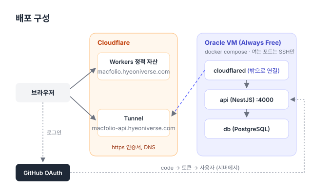

# 배포

프론트엔드는 Cloudflare Workers에, API는 Oracle Cloud Always Free VM에 올린다. 서버는 포트를 열지 않고 Cloudflare Tunnel로만 바깥과 연결한다.



| 무엇       | 주소                                        | 어디에                       | 배포                                                           |
| ---------- | ------------------------------------------- | ---------------------------- | -------------------------------------------------------------- |
| 프론트엔드 | `https://macfolio.hyeoniverse.com`          | Cloudflare Workers 정적 자산 | main에 머지하면 GitHub Actions가                               |
| API        | `https://macfolio-api.hyeoniverse.com`      | Oracle VM, docker compose    | main에 머지하면 GitHub Actions가 이미지를 만들어 서버에 (#100) |
| API 문서   | `https://macfolio-api.hyeoniverse.com/docs` | Swagger                      |                                                                |

프론트엔드와 API는 주소가 다르지만 같은 사이트(`hyeoniverse.com`)다. 그래서 `SameSite=Lax` 세션 쿠키가 함께 간다. **API는 반드시 `hyeoniverse.com`의 하위 도메인에 https로 둔다.** `*.workers.dev`나 IP 주소로 두면 로그인이 되지 않는다.

- [1. 프론트엔드 (Cloudflare Workers)](#1-프론트엔드-cloudflare-workers)
- [2. GitHub OAuth App](#2-github-oauth-app)
- [3. Oracle VM 만들기](#3-oracle-vm-만들기)
- [4. 서버 준비](#4-서버-준비)
- [5. Cloudflare Tunnel](#5-cloudflare-tunnel)
- [6. 설정 파일](#6-설정-파일)
- [7. 실행과 확인](#7-실행과-확인)
- [운영](#운영)
- [문제 해결](#문제-해결)

## 1. 프론트엔드 (Cloudflare Workers)

설정은 루트의 `wrangler.jsonc`에 있다. Worker 스크립트 없이 `apps/react/dist`를 정적 파일로 서빙하고, 없는 경로는 `index.html`로 보낸다(SPA).

빌드와 배포는 GitHub Actions(`.github/workflows/ci.yml`)가 한다. Cloudflare의 빌드 서버(Workers Builds)는 쓰지 않는다.

- **main**: 시험(`check`)이 통과하면 `deploy` 작업이 `wrangler deploy`로 실제 사이트에 올린다. 시험이 실패한 커밋은 배포되지 않는다.
- **PR**: `preview` 작업이 `wrangler versions upload --preview-alias <브랜치>`로 미리보기 버전을 올리고, 주소를 PR 댓글 하나에 적는다(새 커밋을 올리면 같은 댓글을 고친다). 실제 사이트는 바뀌지 않는다.

### 처음 한 번: 토큰과 Git 연결

1. Cloudflare 대시보드 → 오른쪽 위 프로필 → **My Profile → API Tokens → Create Token**
   - **Edit Cloudflare Workers** 템플릿을 고른다
   - Account Resources: 내 계정, Zone Resources: All zones from an account (또는 hyeoniverse.com)
   - 만든 토큰은 한 번만 보이니 바로 복사한다
2. 계정 ID: Workers & Pages 화면 오른쪽의 **Account ID**를 복사한다
3. GitHub 저장소 → Settings → Secrets and variables → **Actions → New repository secret**
   - `CLOUDFLARE_API_TOKEN` = 1의 토큰
   - `CLOUDFLARE_ACCOUNT_ID` = 2의 계정 ID
4. GitHub Actions 배포가 한 번 성공한 것을 확인한 뒤, Cloudflare의 Git 연결을 끊는다. 두 곳에서 같이 배포하지 않게 하기 위해서다.
   - Workers & Pages → `macfolio` → Settings → **Build** → Git repository → **Disconnect**

### API 주소 넣기

`VITE_API_URL`은 **빌드할 때** 코드에 들어간다. 런타임 변수가 아니다. 값은 `ci.yml` 맨 위의 `env`에 있다(`https://macfolio-api.hyeoniverse.com`, 끝에 `/` 없이). 바꾸려면 그 줄을 고쳐 main에 머지한다.

Cloudflare 대시보드의 Variables and Secrets는 Worker가 **실행될 때** 읽는 값이라, 여기에 넣어도 빌드에 들어가지 않는다. 값이 비어 있으면 로그인 버튼이 꺼지고 "관리자 서버가 아직 연결되지 않았습니다"가 뜬다.

`VITE_MESSAGES_STORE`는 배포에 넣지 않는다(비워 둔다). 비어 있으면 메시지 앱이 서버에 저장하고, 서버에 닿지 못하면 "메시지를 열 수 없습니다" 경고창을 띄운 뒤 앱을 끈다. `local`은 서버 없이 화면을 확인하는 개발용 값이라, 배포에 넣으면 방문자마다 자기 브라우저에만 글이 남는다.

반영됐는지는 배포된 JS에서 주소를 찾아 보면 알 수 있다.

```bash
for f in $(curl -s https://macfolio.hyeoniverse.com/ | grep -o '/assets/[^"]*\.js'); do
  curl -s "https://macfolio.hyeoniverse.com$f" | grep -o 'https://macfolio-api.hyeoniverse.com' | head -1
done
```

## 2. GitHub OAuth App

GitHub → Settings → Developer settings → OAuth Apps → New OAuth App

| 항목                       | 배포용                                                      | 개발용                                       |
| -------------------------- | ----------------------------------------------------------- | -------------------------------------------- |
| Homepage URL               | `https://macfolio.hyeoniverse.com`                          | `http://localhost:5173`                      |
| Authorization callback URL | `https://macfolio-api.hyeoniverse.com/auth/github/callback` | `http://localhost:4000/auth/github/callback` |

OAuth App 하나에는 콜백 주소를 하나만 넣을 수 있어서, 배포용과 개발용을 따로 만든다. 만든 뒤 Client ID와 Client secret을 받아 둔다. secret은 만들 때 한 번만 보인다.

관리자는 계정 이름이 아니라 숫자 ID로 가린다(`ADMIN_GITHUB_ID`, 기본 `68999618` = hyeoniverse). 이름은 바꿀 수 있고, 바꾸면 옛 이름을 다른 사람이 가져갈 수 있기 때문이다.

## 3. Oracle VM 만들기

[Always Free](https://www.oracle.com/cloud/free/) 한도 안에서는 기간 제한 없이 무료다. 가입할 때 카드 등록이 필요하지만 Free Tier 계정에는 청구되지 않는다. 홈 리전은 가입한 뒤에 바꿀 수 없다.

Compute → Instances → Create instance

| 항목       | 고를 것                                                                                                     |
| ---------- | ----------------------------------------------------------------------------------------------------------- |
| Image      | Canonical Ubuntu 24.04                                                                                      |
| Shape      | `VM.Standard.A1.Flex`(ARM, 합계 4 OCPU·24GB까지 무료) 또는 `VM.Standard.E2.1.Micro`(AMD, 1GB, 2대까지 무료) |
| Security   | 기본값 그대로. Shielded instance, Confidential computing은 켜지 않는다                                      |
| Networking | public subnet + **Automatically assign public IPv4 address**                                                |
| SSH keys   | Generate a key pair → **Download private key** (다시 받을 수 없다)                                          |

- **"Always Free Eligible"** 표시가 있는 shape인지 확인한다. `E4/E5.Flex` 같은 다른 AMD shape는 유료다.
- A1은 인기 리전에서 `Out of host capacity`가 자주 난다. 지금 서버는 A1 자리가 없어서 **E2.1.Micro**(x86_64, 1GB)로 만들었다. `apps/api/Dockerfile`은 amd64와 arm64 모두 빌드된다.
- 공인 IP 체크박스가 "You must select a public subnet"으로 막히면, VCN을 먼저 만든다: Networking → Virtual cloud networks → **Start VCN Wizard** → Create VCN with Internet Connectivity. 그 뒤 인스턴스 화면에서 Select existing → `public subnet-…`을 고른다.
- VNIC name은 비워 둬도 된다.

접속은 Mac에서 한다. 키는 레포 밖(`~/.ssh`)에 둔다.

```bash
mv ~/Downloads/ssh-key-*.key ~/.ssh/oracle-macfolio.key
chmod 600 ~/.ssh/oracle-macfolio.key
ssh -i ~/.ssh/oracle-macfolio.key ubuntu@<공인 IP>
```

프롬프트가 `ubuntu@…:~$`면 서버 안이다. 아래 명령은 모두 서버에서 실행한다.

## 4. 서버 준비

### swap (E2.1.Micro)

RAM이 1GB라 Docker 빌드(pnpm install, tsc)가 메모리 부족으로 죽는다. 평소에는 GitHub Actions가 빌드하지만, 급할 때 서버에서 빌드할 수 있게 swap을 잡아 둔다.

```bash
sudo fallocate -l 4G /swapfile
sudo chmod 600 /swapfile
sudo mkswap /swapfile
sudo swapon /swapfile
echo '/swapfile none swap sw 0 0' | sudo tee -a /etc/fstab
free -h   # Swap: 4.0Gi
```

### Docker

```bash
sudo apt update && sudo apt upgrade -y
curl -fsSL https://get.docker.com | sudo sh
sudo usermod -aG docker ubuntu
exit   # 다시 접속해야 docker 그룹이 적용된다
```

다시 접속해서 `docker run --rm hello-world`로 확인한다.

### 코드

```bash
git clone https://github.com/hyeoniverse/MacFolio.git ~/macfolio
mkdir -p ~/deploy
```

서버 안은 이렇게 된다. 비밀 값은 레포 밖(`~/deploy`)에 둬서 커밋될 일이 없고, `git pull`해도 남는다.

```
/home/ubuntu/
├── macfolio/        코드 (git clone)
└── deploy/          배포 설정
    ├── .env         DB_PASSWORD, TUNNEL_TOKEN
    ├── api.env      API 환경 변수
    └── compose.yml
```

## 5. Cloudflare Tunnel

서버가 Cloudflare로 **나가는** 연결을 만들고, 요청은 그 연결로 들어온다. 그래서 Oracle 방화벽에 80/443을 열 필요가 없고, https 인증서도 Cloudflare가 맡는다.

Cloudflare Zero Trust → Networks → Tunnels → **Create a tunnel** → Cloudflared → 이름 `macfolio-api`

1. 운영체제는 **Docker**를 고른다. 나오는 `docker run … --token eyJ…` 명령은 실행하지 않고, `--token` 뒤의 값만 복사한다
2. Public Hostname 추가
   - Subdomain `macfolio-api`, Domain `hyeoniverse.com`
   - Service: `HTTP`, URL: `api:4000` (compose 안의 서비스 이름)

DNS에 `macfolio-api` 레코드가 이미 있으면 먼저 지워야 추가된다. 토큰은 터널 비밀번호다. `.env`에만 둔다.

## 6. 설정 파일

모두 `~/deploy`에서 만든다. **YAML을 터미널에 그대로 붙여 넣지 말고** `cat > 파일 <<'EOF' … EOF`로 감싸서 한 번에 붙여 넣는다. 그대로 붙이면 셸이 한 줄씩 명령으로 실행해 `command not found`가 줄줄이 나온다.

### `.env` (compose가 읽는 비밀 값)

```bash
cd ~/deploy
cat > .env <<EOF
DB_PASSWORD=$(openssl rand -hex 24)
TUNNEL_TOKEN=<5단계에서 복사한 토큰>
EOF
```

### `api.env` (API 환경 변수)

서버의 API는 이 파일만 읽는다. 내 컴퓨터의 `apps/api/.env`는 로컬 개발용이라 배포와 상관없다. 배포용 값을 내 컴퓨터에 적어 둘 때는 `.env`가 아니라 `apps/api/.env.production`에 둔다(커밋되지 않고, 로컬 API도 읽지 않는다). 로컬 `.env`의 `CORS_ORIGINS`를 배포 값으로 바꾸면 로컬 사이트가 서버에 연결하지 못한다.

```bash
cat > api.env <<EOF
CORS_ORIGINS=https://macfolio.hyeoniverse.com,https://*-macfolio.hyeoniverse.workers.dev
API_URL=https://macfolio-api.hyeoniverse.com
GITHUB_CLIENT_ID=<배포용 OAuth App Client ID>
GITHUB_CLIENT_SECRET=<배포용 OAuth App Client secret>
IP_HASH_SECRET=$(openssl rand -hex 32)
TRUST_PROXY=1
EOF
chmod 600 .env api.env
```

| 변수                                                  | 필수   | 설명                                                                                                                                                                                                |
| ----------------------------------------------------- | ------ | --------------------------------------------------------------------------------------------------------------------------------------------------------------------------------------------------- |
| `DATABASE_URL`                                        | ✓      | compose.yml에서 `db` 서비스 주소로 넣는다                                                                                                                                                           |
| `CORS_ORIGINS`                                        | ✓      | 요청을 받을 프론트엔드 주소 (쉼표로 여러 개). 한 글자라도 다르면(끝의 `/`, `www`) CORS 에러. `*`는 점 없는 이름 한 칸에 맞아, `https://*-macfolio.hyeoniverse.workers.dev`로 PR 미리보기를 허용한다 |
| `API_URL`                                             | ✓      | 이 API의 바깥 주소. OAuth 콜백 주소를 여기서 만든다                                                                                                                                                 |
| `GITHUB_CLIENT_ID`                                    | 로그인 | 비우면 로그인만 503, 나머지 API는 동작한다                                                                                                                                                          |
| `GITHUB_CLIENT_SECRET`                                | 로그인 |                                                                                                                                                                                                     |
| `IP_HASH_SECRET`                                      | ✓      | 댓글 작성자 IP를 HMAC하는 키. production에서 없으면 서버가 뜨지 않는다                                                                                                                              |
| `TRUST_PROXY`                                         |        | 앞에 둔 프록시 수. Tunnel만 거치면 `1`. `X-Forwarded-For`에서 실제 IP를 읽어 요청 제한에 쓴다                                                                                                       |
| `FRONTEND_URL`                                        |        | 로그인 후 돌아갈 주소 (기본: `CORS_ORIGINS`의 첫 주소)                                                                                                                                              |
| `ADMIN_GITHUB_ID`                                     |        | 관리자 GitHub 숫자 ID (기본 68999618)                                                                                                                                                               |
| `UNSPLASH_ACCESS_KEY`, `PEXELS_API_KEY`               |        | 편집기의 사진 찾기. 없으면 그 서비스만 꺼진다                                                                                                                                                       |
| `GITHUB_TOKEN`                                        |        | GitHub 앱의 프로필·저장소를 받을 토큰. 없으면 시간당 60번 제한이라 30분마다 새로 받는다                                                                                                             |
| `FISH_AUDIO_API_KEY`, `GOOGLE_TTS_API_KEY`            |        | Safari HYEONIVERSE 페이지의 음성 만들기 (Fish → Google → Edge). 없으면 그 공급자만 건너뛴다 (Edge는 키 없이 된다)                                                                                   |
| `SPEECH_PER_IP_PER_DAY`, `SPEECH_TOTAL_PER_DAY`       |        | 음성 만들기 하루 상한. 기본 IP마다 3번, 사이트 전체 50번 (서버 메모리로 센다)                                                                                                                       |
| `DEEPL_API_KEY`, `GOOGLE_TRANSLATE_API_KEY`           |        | 번역 데모 (DeepL → Google). HYEONIVERSE와 같은 키. 없으면 그 공급자만 건너뛴다                                                                                                                      |
| `GROQ_API_KEY`                                        |        | AI 요약 데모의 기본 공급자 (Groq, OpenAI 호환 API). 없거나 실패하면 Gemini로 넘어간다                                                                                                               |
| `GROQ_MODEL`                                          |        | Groq 모델 (기본 `openai/gpt-oss-120b`). Groq는 모델을 자주 내리므로, 요약이 Gemini로만 만들어지면 내려갔는지 본다                                                                                   |
| `GEMINI_API_KEY`                                      |        | AI 요약 데모의 두 번째 공급자 (Groq가 실패할 때). 둘 다 없으면 요약이 502                                                                                                                           |
| `GEMINI_MODEL`                                        |        | 요약 모델 (기본 `gemini-flash-latest`, 늘 최신 Flash). 내려간 모델이면 응답이 권하는 모델로 한 번 다시 묻는다                                                                                       |
| `CLOUDFLARE_ACCOUNT_ID`, `CLOUDFLARE_AI_TOKEN`        |        | AI 커버 데모의 첫 공급자 (Cloudflare Workers AI FLUX, 매일 무료 할당). 토큰에는 Workers AI 권한만 준다                                                                                              |
| `HUGGINGFACE_API_KEY`                                 |        | AI 커버 데모의 두 번째 공급자 (Hugging Face FLUX). 둘 다 없으면 커버가 502                                                                                                                          |
| `TRANSLATE_PER_IP_PER_DAY`, `TRANSLATE_TOTAL_PER_DAY` |        | 번역 하루 상한. 기본 IP마다 3번, 사이트 전체 50번                                                                                                                                                   |
| `SUMMARY_PER_IP_PER_DAY`, `SUMMARY_TOTAL_PER_DAY`     |        | 요약 하루 상한. 기본 IP마다 3번, 사이트 전체 50번                                                                                                                                                   |
| `COVER_PER_IP_PER_DAY`, `COVER_TOTAL_PER_DAY`         |        | 커버 하루 상한. 기본 IP마다 1번, 사이트 전체 5번 (무료 한도가 작다)                                                                                                                                 |

데모 상한은 데모마다 따로, 서버 메모리로 센다 (다시 띄우면 처음부터). 공급자가 모두 실패하면 쓴 횟수를 돌려준다. 커버는 두 공급자를 이어 시도해도 Cloudflare Tunnel의 100초 안에 끝나게 각각 45초에서 끊는다.

`NODE_ENV=production`은 Dockerfile에 들어 있다. 그래서 쿠키에 `Secure`가 붙고, http로는 로그인이 되지 않는다. 전체 목록은 `apps/api/.env.example`에 있다.

### `compose.yml`

`'EOF'`에 따옴표를 붙여야 `${DB_PASSWORD}`가 지금 치환되지 않고 글자 그대로 들어간다. 실행할 때 compose가 `.env`에서 채운다.

```bash
cat > compose.yml <<'EOF'
name: macfolio
services:
  db:
    image: postgres:17-alpine
    restart: unless-stopped
    environment:
      POSTGRES_USER: macfolio
      POSTGRES_PASSWORD: ${DB_PASSWORD}
      POSTGRES_DB: macfolio
    volumes:
      - db-data:/var/lib/postgresql/data
    healthcheck:
      test: ['CMD-SHELL', 'pg_isready -U macfolio']
      interval: 5s
      retries: 20

  api:
    # GitHub Actions가 만든 이미지 (서버에서 빌드하지 않는다). 태그는 .env의 API_TAG, ops/deploy.sh가 바꾼다
    image: ghcr.io/hyeoniverse/macfolio-api:${API_TAG:?API_TAG가 없다. ~/macfolio/ops/deploy.sh <태그>로 배포한다}
    restart: unless-stopped
    env_file: api.env
    environment:
      DATABASE_URL: postgresql://macfolio:${DB_PASSWORD}@db:5432/macfolio
    depends_on:
      db:
        condition: service_healthy

  tunnel:
    image: cloudflare/cloudflared:latest
    restart: unless-stopped
    command: tunnel --no-autoupdate run
    environment:
      TUNNEL_TOKEN: ${TUNNEL_TOKEN}
    depends_on: [api]

volumes:
  db-data:
EOF
docker compose config --quiet && echo OK
```

`ports`가 하나도 없다. 바깥 요청은 터널로만 api에 닿고, DB는 compose 네트워크 밖으로 나가지 않는다.

## 7. 실행과 확인

API 이미지는 GitHub Actions가 만들어 GHCR(`ghcr.io/hyeoniverse/macfolio-api`)에 올려 둔다. 서버는 받기만 한다. 태그는 `sha-` + 커밋 7자리(예: `sha-a38ac7e`)이고, GitHub 저장소 오른쪽의 **Packages → macfolio-api**에서 최근 태그를 본다. 아래 명령의 `sha-a38ac7e`는 예시이니 그 태그로 바꾼다 (`<…>` 같은 자리표시를 그대로 붙여 넣으면 bash가 `<`·`>`를 기호로 읽어 아무것도 하지 않는다).

```bash
cd ~/deploy
~/macfolio/ops/deploy.sh sha-a38ac7e        # .env에 API_TAG를 쓰고 api(+db)를 띄워 healthy까지 기다린다
docker compose up -d                        # tunnel까지
docker compose logs -f api                  # 마이그레이션이 끝나고 "Nest application successfully started"
```

시작할 때 `prisma migrate deploy`가 먼저 돈다. Cloudflare Tunnels 화면에서 상태가 **HEALTHY**가 되면 연결된 것이다.

1. `https://macfolio-api.hyeoniverse.com/health`가 응답한다
2. `https://macfolio-api.hyeoniverse.com/docs`에 Swagger가 뜬다
3. `https://macfolio-api.hyeoniverse.com/auth/github`가 GitHub 로그인으로 넘어간다 (503이면 OAuth 값이 없다)
4. 사이트의 Apple 메뉴 → 관리자 로그인 → `?admin=signed-in`으로 돌아오고, 시스템 설정 → 계정에 "GitHub로 로그인됨"이 뜬다

## 운영

### 업데이트 (자동 배포)

`apps/api`(또는 의존성, `ops/deploy.sh`)가 바뀐 커밋이 main에 들어오면 GitHub Actions가 알아서 한다 (#100).

```
check(시험) ─▶ api-image: 이미지 빌드(amd64) → GHCR (sha-<커밋>, main)
              └▶ api-deploy: SSH로 서버의 ops/deploy.sh sha-<커밋>
                   배포 직전 백업(서버에만) → 이미지 받기 → 교체 → healthy·/health의 version 확인
                   안 되면 이전 태그로 되돌리고 실패
              └▶ 바깥 https://macfolio-api.hyeoniverse.com/health의 version이 이번 커밋인지
         └▶ deploy(프론트엔드): API 배포가 끝난 뒤에. API 배포가 실패하면 하지 않는다
```

- API를 쓰는 프론트엔드 변경도 같은 PR로 머지하면 된다. API가 먼저 올라간다
- 마이그레이션은 컨테이너가 시작할 때 적용된다. 되돌리기는 **이미지만** 되돌리므로, 마이그레이션은 이전 버전 코드와 함께 돌 수 있게 만든다 (CONTRIBUTING의 '마이그레이션')
- 서버의 배포 기록: `~/deploy/deploy.log`. 배포 직전 백업: `~/backups`

**손으로 배포·되돌리기:** GitHub → Actions → **API 배포** → Run workflow → 태그(`sha-…`). 예전 태그를 넣으면 되돌리기다. 서버에서 바로 하려면 `~/macfolio/ops/deploy.sh sha-…`.

**급할 때 서버에서 빌드:** GitHub Actions를 쓸 수 없을 때만. 1GB라 10분 넘게 걸리고 swap이 있어야 한다.

```bash
cd ~/macfolio && git pull
tag=sha-$(git rev-parse --short=7 HEAD)
docker build -f apps/api/Dockerfile --build-arg APP_VERSION=$tag -t ghcr.io/hyeoniverse/macfolio-api:$tag .
~/macfolio/ops/deploy.sh $tag   # 서버에 그 태그의 이미지가 있으면 받지 않고 그대로 쓴다
```

**환경 변수는 자동으로 바뀌지 않는다.** 자동 배포는 이미지(코드)만 바꾼다. 비밀 값은 서버에만 둔다 (GitHub와 서버 두 곳에 두지 않고, 배포 전용 키에 파일 쓰기 권한을 주지 않으려고).

| 무엇                                            | 어디에                            | 바꾸면                                          |
| ----------------------------------------------- | --------------------------------- | ----------------------------------------------- |
| API 환경 변수 (OAuth, `CORS_ORIGINS`, AI 키 등) | 서버 `~/deploy/api.env`           | 아래 명령으로 직접 반영                         |
| DB 비밀번호, 터널 토큰                          | 서버 `~/deploy/.env`              | 직접 반영. `API_TAG`는 `ops/deploy.sh`가 바꾼다 |
| 백업 설정                                       | 서버 `~/deploy/backup.env`        | 다음 백업부터                                   |
| 프론트엔드 `VITE_API_URL`                       | 저장소 `.github/workflows/ci.yml` | 머지하면 (빌드할 때 들어간다)                   |
| `apps/api/.env`                                 | 내 컴퓨터                         | 로컬 개발용. 서버로 가지 않는다                 |

```bash
cd ~/deploy
nano api.env                 # 값 수정
docker compose up -d api     # 바뀐 설정을 보고 컨테이너만 새로 띄운다 (이미지는 그대로)
docker compose ps api        # healthy인지
```

고쳐 두고 띄우지 않으면 다음 자동 배포 때 함께 반영된다. 언제가 될지 모르니 바로 띄운다.

### 자동 배포 설정 (한 번)

명령마다 **어디서** 치는지 먼저 본다. 줄 맨 앞이 `ubuntu@macfolio-vnic`이면 서버, `…@…MacBook…`이면 내 컴퓨터다. 이 설정은 2를 빼면 모두 **서버**에서 한다.

#### 1. 이미지와 첫 배포

main에 API 변경이 머지되면 `api-image`가 이미지를 GHCR에 올린다. 이 저장소처럼 공개 저장소에 연결된 패키지는 처음부터 공개라 서버에서 로그인 없이 받는다. 로그인 없이 받히는지는 이렇게 본다 (200이면 공개).

```bash
tok=$(curl -s "https://ghcr.io/token?scope=repository:hyeoniverse/macfolio-api:pull" | sed -E 's/.*"token":"([^"]+)".*/\1/')
curl -s -o /dev/null -w "%{http_code}\n" -H "Authorization: Bearer $tok" \
  -H "Accept: application/vnd.oci.image.index.v1+json" https://ghcr.io/v2/hyeoniverse/macfolio-api/manifests/sha-a38ac7e
```

401·403이면 GitHub 프로필 → **Packages → macfolio-api → Package settings → Change visibility → Public**.

그다음 서버 `compose.yml`의 api를 `image:`로 바꾸고 첫 배포를 손으로 한 번 한다 (6·7단계). 이때부터 `.env`에 `API_TAG`가 생긴다.

#### 2. 배포 전용 열쇠 (서버에서 한 번에)

GitHub Actions가 서버에 들어올 열쇠를 하나 만들되, 그 열쇠로는 **배포 스크립트 하나만** 돌게 묶는다. 열쇠는 서버에서 만들어 GitHub에 넣고 서버에서는 지운다 (내 컴퓨터와 서버 사이에 옮길 것이 없다).

서버에서 아래를 통째로 붙여 넣는다. 고칠 곳은 없다. 여러 번 해도 된다: 늘 예전 배포 열쇠를 지우고 새로 만든다.

```bash
sed -i '/github-actions-deploy/d' ~/.ssh/authorized_keys
rm -f ~/macfolio-deploy ~/macfolio-deploy.pub
ssh-keygen -q -t ed25519 -N "" -C github-actions-deploy -f ~/macfolio-deploy
echo "restrict,command=\"/home/ubuntu/macfolio/ops/deploy.sh\" $(cat ~/macfolio-deploy.pub)" >> ~/.ssh/authorized_keys
echo "등록된 배포 열쇠 수: $(grep -c github-actions-deploy ~/.ssh/authorized_keys)"
echo "===== DEPLOY_HOST ====="; curl -s ifconfig.me; echo
echo "===== DEPLOY_KNOWN_HOSTS ====="; ssh-keyscan -t ed25519 localhost 2>/dev/null | sed "s/^localhost/$(curl -s ifconfig.me)/"
echo "===== DEPLOY_SSH_KEY ====="; cat ~/macfolio-deploy
```

- 첫 줄은 배포 열쇠 줄(끝이 `github-actions-deploy`)만 지운다. 평소 접속하는 열쇠는 다른 줄이라 남는다
- `restrict`: 포트 포워딩, 터미널(pty) 등을 모두 막는다
- `command=`: 이 열쇠로 접속하면 무엇을 보내든 `ops/deploy.sh`만 돈다. 보낸 글자는 `SSH_ORIGINAL_COMMAND`로 넘어가고, 스크립트가 `sha-[0-9a-f]{7,40}` 모양만 받는다
- `DEPLOY_KNOWN_HOSTS`: 서버 자기 호스트 키를 서버에서 읽어 공인 IP를 붙인다. Actions가 가짜 서버에 붙지 않게 고정하는 값이다

`등록된 배포 열쇠 수: 1`이 나와야 한다.

#### 3. GitHub Secrets

저장소 → Settings → Secrets and variables → Actions → New repository secret (이미 있으면 연필 → Update)

| 이름                 | 값                                                                       |
| -------------------- | ------------------------------------------------------------------------ |
| `DEPLOY_HOST`        | 2의 `DEPLOY_HOST` 아래 IP                                                |
| `DEPLOY_KNOWN_HOSTS` | 2의 `DEPLOY_KNOWN_HOSTS` 아래 한 줄                                      |
| `DEPLOY_SSH_KEY`     | 2의 `DEPLOY_SSH_KEY` 아래 전체 (`-----BEGIN`부터 `-----END … -----`까지) |
| `DEPLOY_USER`        | (선택) 기본 `ubuntu`                                                     |

넣었으면 서버의 열쇠 파일을 지운다: `rm ~/macfolio-deploy ~/macfolio-deploy.pub`. 열쇠를 새로 만들었으면 **`DEPLOY_SSH_KEY`도 새 값으로** 바꿔야 한다 (아니면 `Permission denied (publickey)`).

`DEPLOY_HOST`가 없으면 `api-deploy`는 건너뛴다(이미지는 만든다). Oracle 보안 목록에서 22번이 내 IP에만 열려 있으면 Actions가 들어오지 못한다. 열쇠 인증만 쓰므로 22번은 모든 곳에 열어 둔다 (나중에 Cloudflare Tunnel SSH로 옮기면 닫는다, #100).

#### 4. 확인

[Actions → API 배포](https://github.com/hyeoniverse/MacFolio/actions/workflows/deploy-api.yml) → 오른쪽 위 **Run workflow** → tag에 지금 태그 (예: `sha-a38ac7e`) → Run. Actions 첫 화면(All workflows)에는 이 단추가 없다. 왼쪽 목록에서 **API 배포**를 눌러야 보인다.

로그에 이렇게 나오면 연결이 끝난 것이다.

```text
서버에서 배포:      배포 시작: sha-a38ac7e → sha-a38ac7e
                    이미 이 버전이 떠 있다: sha-a38ac7e
바깥에서 버전 확인: 확인: {"status":"ok","database":"up","version":"sha-a38ac7e"}
```

열쇠는 GitHub(Secrets)과 서버에만 있으므로 연결 확인은 Actions로 한다. 열쇠가 배포 명령 하나만 도는지(`ls` 같은 다른 명령은 "태그 모양이 아니다")는 스크립트가 태그 모양만 받는 것으로 막는다 (로컬에서 시험함).

#### Secrets를 넣기 전에 머지한 API 변경

Secrets가 없을 때 머지된 API 변경은 이미지만 만들고 서버 배포는 건너뛴다(Actions에 "DEPLOY_HOST가 없어 API 배포를 건너뜁니다"). 서버는 예전 버전으로 남는다. 그 커밋의 태그로 Run workflow를 한 번 하면 된다. 태그는 `sha-` + 머지 커밋 7자리이고, main의 최근 커밋은 `git log --oneline -1 origin/main`, 올라간 태그는 저장소 오른쪽 **Packages → macfolio-api**에서 본다.

### 로그와 상태

```bash
docker compose ps
docker compose logs --tail=100 api
docker compose logs --tail=100 tunnel
```

### 백업

블로그 글·임시 저장·버전 기록·올린 이미지가 **모두 DB에만** 있다. `ops/backup.sh`를 cron으로 매일 돌려 서버와 서버 밖(Cloudflare R2)에 남긴다.

- 서버: `~/backups`에 7일 (`KEEP_LOCAL_DAYS`)
- 자동 배포 직전에도 한 번 (`ops/deploy.sh`가 `BACKUP_LOCAL_ONLY=1`로 부른다. 서버에만 남기고 알리지 않는다. 서버 밖으로는 매일 cron이 올린다)
- 서버 밖: R2 버킷에 30일 (`KEEP_REMOTE_DAYS`)
- 서버 밖 저장소 상한: 8GB (`MAX_REMOTE_GB`). 오늘 백업을 더하면 넘을 때는 올리지 않고 실패로 알린다 (서버에는 남는다). R2는 매달 10GB까지 무료이고, 넘으면 청구되기 전에 멈추는 설정이 없어서 스크립트가 먼저 멈춘다. 알림이 오면 `KEEP_REMOTE_DAYS`를 줄이거나 상한을 올린다 (넘은 만큼 1GB당 월 $0.015)
- 압축이 온전한지, 덤프가 끝까지 쓰였는지 검사한 뒤에만 남긴다. 실패하면 1로 끝나고 알림 주소(`BACKUP_PING_URL`)에 알린다

설정은 한 번만 하면 된다. 키 같은 비밀 값은 서버의 `~/deploy/backup.env`에만 넣는다 (저장소·채팅에 남기지 않는다). 대시보드 메뉴 이름은 바뀔 수 있으니 비슷한 이름을 찾는다.

#### 1. R2 버킷 (Cloudflare 대시보드)

1. **R2 Object Storage**로 간다. 처음이면 무료 플랜으로 사용을 신청한다 (결제 수단 등록을 요구할 수 있다. 한도 안이면 청구되지 않는다)
2. **Create bucket**
   - 이름: `macfolio-backups`
   - 위치: Automatic
   - 저장 클래스: **Standard** (Infrequent Access에는 무료 한도가 없다)
3. 버킷 Settings에서 **Public access가 꺼져 있는지**(Disallowed, 기본값) 본다. 공개하지 않아야 다른 사람이 파일을 읽어 작업 수를 늘릴 수 없다

#### 2. R2 API 토큰

1. R2 첫 화면의 **Manage R2 API Tokens → Create API token**
   - 이름: `macfolio-backup`
   - 권한: **Object Read & Write**
   - 버킷: **Apply to specific buckets only** → `macfolio-backups` (키가 새어도 이 버킷만)
   - TTL: Forever
2. 만들면 나오는 값 셋을 잠깐 적어 둔다. **비밀 키는 이 화면에서만 보인다**
   - Access Key ID
   - Secret Access Key
   - S3 엔드포인트: `https://<계정 ID>.r2.cloudflarestorage.com`
   - 함께 나오는 Token value는 쓰지 않는다

#### 3. 알림 주소 (선택, 추천)

cron은 실패해도 아무 말이 없다. 알림 주소를 넣으면 백업이 실패하거나, 상한에 걸리거나, 아예 돌지 않았을 때 메일이 온다.

1. https://healthchecks.io 에 가입하고 **Add Check**
   - 이름: `macfolio-backup`
   - Schedule: Period **1 day**, Grace **1 hour**
2. **Ping URL**(`https://hc-ping.com/<uuid>`)을 적어 둔다. 알림은 가입한 메일로 간다

#### 4. 서버: 코드와 rclone

```bash
cd ~/macfolio && git pull           # ops/backup.sh, ops/restore.sh
ls -l ops/backup.sh                 # 실행 권한(x)이 있는지

# R2(provider=Cloudflare)는 rclone 1.59부터 된다. apt의 rclone은 Ubuntu 22.04에서 1.53이라 공식 설치 스크립트로 받는다
curl -fsSL https://rclone.org/install.sh | sudo bash
rclone version                      # v1.59 이상인지
```

#### 5. 서버: 설정 파일

```bash
cd ~/deploy
ls                                  # compose.yml이 있는지 (없거나 이름이 다르면 아래에 COMPOSE_FILE=<경로>)
cat > backup.env <<'EOF'
BACKUP_REMOTE=r2:macfolio-backups
RCLONE_CONFIG_R2_TYPE=s3
RCLONE_CONFIG_R2_PROVIDER=Cloudflare
RCLONE_CONFIG_R2_ACCESS_KEY_ID=<Access Key ID>
RCLONE_CONFIG_R2_SECRET_ACCESS_KEY=<Secret Access Key>
RCLONE_CONFIG_R2_ENDPOINT=https://<계정 ID>.r2.cloudflarestorage.com
RCLONE_CONFIG_R2_NO_CHECK_BUCKET=true
# 3에서 만든 알림 주소
BACKUP_PING_URL=https://hc-ping.com/<uuid>
# 선택: 서버 밖 저장소 상한 (기본 8), 남길 날 수 (기본 서버 7, R2 30)
# MAX_REMOTE_GB=8
# KEEP_LOCAL_DAYS=7
# KEEP_REMOTE_DAYS=30
EOF
chmod 600 backup.env
```

`<…>`는 2·3에서 적은 값으로 바꾼다 (`nano backup.env`). rclone 설정은 `RCLONE_CONFIG_R2_*` 환경 변수로 넣어서 `rclone config` 파일이 따로 없다. `backup.env`는 `ops/backup.sh`가 읽는다.

#### 6. R2 연결 확인

```bash
set -a; source ~/deploy/backup.env; set +a
rclone size r2:macfolio-backups     # 처음에는 Total objects: 0
# 쓰기도 되는지: 시험 파일을 올리고, 보이는지 보고, 지운다
echo test | rclone rcat r2:macfolio-backups/connection-test.txt
rclone ls r2:macfolio-backups       # connection-test.txt
rclone deletefile r2:macfolio-backups/connection-test.txt
```

- `rclone lsd r2:`(버킷 목록)는 쓰지 않는다. 토큰이 버킷 하나에만 권한이 있어서 계정의 버킷 목록은 늘 `403 AccessDenied`다 (키를 좁게 만든 것이 제대로 걸렸다는 뜻)
- `Config file … not found` 안내는 설정을 환경 변수로 넣어서 나오는 것이라 상관없다
- 버킷을 볼 때 `AccessDenied`: 토큰의 권한(Object Read & Write)·버킷 범위를 확인한다
- `no such host`: 엔드포인트 주소를 확인한다

#### 7. 한 번 돌려 보기

```bash
~/macfolio/ops/backup.sh
# … 백업 완료: /home/ubuntu/backups/macfolio-…sql.gz (…)
# … 올림: r2:macfolio-backups/macfolio-…sql.gz (저장소 …MB / 상한 8GB)
```

- `ls -lh ~/backups`: 파일 크기 × 30이 상한(8GB)보다 넉넉히 작은지
- R2 대시보드의 버킷에 파일이 생겼는지
- healthchecks.io의 Check가 up(초록)인지

#### 8. 매일 돌게 하기 (cron)

```bash
date                                # 서버 시간대 (보통 UTC)
crontab -e                          # 아래 한 줄 (03:30 UTC = 12:30 KST)
30 3 * * * /home/ubuntu/macfolio/ops/backup.sh >> /home/ubuntu/deploy/backup.log 2>&1
crontab -l                          # 들어갔는지
```

다음 날 `tail ~/deploy/backup.log`로 결과를 본다.

#### 9. 되살리기 시험

```bash
cd ~/deploy
# 가장 최근 백업 (파일 이름을 손으로 적지 않는다. <…>를 그대로 넣으면 bash가 기호로 읽어 아무것도 하지 않는다)
latest=$(ls -t ~/backups/macfolio-*.sql.gz | head -1); echo "$latest"
# 실제 DB를 건드리지 않고 다른 DB에 되살려 본다
DB_NAME=restoretest ~/macfolio/ops/restore.sh "$latest"
# 글 수가 실제 DB와 같은지
docker compose exec -T db psql -U macfolio -d restoretest -c 'select count(*) from "Post"'
docker compose exec -T db psql -U macfolio -d macfolio -c 'select count(*) from "Post"'
docker compose exec -T db psql -U macfolio -d postgres -c 'drop database restoretest'
```

한 달에 한 번쯤 이렇게 되살려 보고 글 수를 맞춰 본다. 되살려 보지 않은 백업은 백업이 아니다.

#### 10. 사용량 알림 (선택)

R2에는 청구 전에 멈추는 설정이 없다 (스크립트의 `MAX_REMOTE_GB`가 대신 멈춘다). Cloudflare 대시보드 **Notifications → Add**에서 사용량 기반 청구 알림(Usage Based Billing)을 걸어 두면 한 번 더 막는다.

#### 되살리기 (실제로 필요할 때)

```bash
# 실제 DB를 백업 내용으로 바꾼다 (확인을 받고, 그동안 api를 멈췄다가 다시 띄운다)
~/macfolio/ops/restore.sh ~/backups/macfolio-2026-10-05T033000Z.sql.gz
# R2에 있는 백업도 된다 (받아 와서 되살린다)
~/macfolio/ops/restore.sh r2:macfolio-backups/macfolio-2026-10-05T033000Z.sql.gz
```

### 비밀 값 바꾸기

비밀 값이 채팅·스크린샷·로그에 드러났으면 새로 발급한다.

- **GitHub Client secret**: OAuth App → Generate a new client secret → 옛 secret 삭제 → `api.env` 수정
- **Tunnel 토큰**: Tunnels → `macfolio-api` → 토큰 교체 → `.env` 수정
- 적용: `docker compose up -d` (바뀐 컨테이너만 다시 뜬다)

`IP_HASH_SECRET`을 바꾸면 이전 댓글과 새 댓글의 작성자 해시가 이어지지 않는다. 드러난 게 아니면 두는 편이 낫다.

### 유휴 회수

Oracle은 7일 동안 CPU·네트워크·메모리 사용률이 모두 낮은 Always Free 인스턴스를 회수할 수 있다. 계정을 **Pay As You Go로 업그레이드**하면 회수 대상에서 빠지고, Always Free 한도 안에서는 그대로 0원이다. 업그레이드했다면 Budget 알림(예: 월 $1)을 걸어 둔다. 회수돼도 다시 만들 수 있게 이 문서와 서버 밖 백업을 유지한다.

## 문제 해결

| 증상                                                                 | 원인과 해결                                                                                                                                                                                      |
| -------------------------------------------------------------------- | ------------------------------------------------------------------------------------------------------------------------------------------------------------------------------------------------ |
| "관리자 서버가 아직 연결되지 않았습니다", 로그인 버튼이 꺼짐         | 프론트 빌드에 `VITE_API_URL`이 없다. Cloudflare **Build** 변수에 넣고 다시 빌드한다 ([1](#1-프론트엔드-cloudflare-workers))                                                                      |
| 메시지를 열면 "메시지를 열 수 없습니다"                              | 메시지 API에 닿지 못했다. `docker compose ps`, `logs api` 확인. 서버 없이 화면만 볼 때는 `VITE_MESSAGES_STORE=local`                                                                             |
| "관리자 서버에 연결할 수 없습니다"                                   | API가 내려갔거나 CORS가 막혔다. `docker compose ps`, `logs api`, `CORS_ORIGINS` 확인                                                                                                             |
| 서버 상태가 "이 주소에서는 쓸 수 없음"                               | 서버는 켜져 있지만 지금 사이트 주소가 `CORS_ORIGINS`에 없다. PR 미리보기라면 `https://*-macfolio.hyeoniverse.workers.dev`를 더하고 `docker compose up -d api`                                    |
| `/auth/github`가 503                                                 | `GITHUB_CLIENT_ID`/`SECRET`이 비었다                                                                                                                                                             |
| GitHub에서 `redirect_uri` 오류                                       | OAuth App 콜백 주소와 `API_URL` + `/auth/github/callback`이 다르다                                                                                                                               |
| 돌아왔는데 "로그인할 수 없음"                                        | 관리자 계정(ID 68999618)이 아닌 GitHub 계정으로 로그인했다                                                                                                                                       |
| 돌아왔는데 로그인이 안 된 상태                                       | 쿠키가 저장되지 않았다. https인지, API가 `hyeoniverse.com` 하위 도메인인지 확인                                                                                                                  |
| api가 시작하자마자 꺼짐                                              | `IP_HASH_SECRET` 없음, DB 연결 실패 등. `docker compose logs api`의 첫 에러를 본다                                                                                                               |
| 빌드 중 멈추거나 `Killed`                                            | 메모리 부족. swap을 잡았는지 `free -h`로 확인                                                                                                                                                    |
| Actions '서버에서 배포'가 `Permission denied (publickey)` (exit 255) | `DEPLOY_SSH_KEY`가 서버에 등록된 배포 열쇠와 짝이 아니다. 열쇠를 두 번 만들어 GitHub과 서버에 다른 열쇠가 들어간 경우가 많다. '자동 배포 설정' 2를 다시 하고 `DEPLOY_SSH_KEY`를 새 값으로 바꾼다 |
| API 변경을 머지했는데 `/health`의 version이 그대로                   | Secrets를 넣기 전에 머지했거나 배포가 건너뛰어졌다. 그 커밋 태그로 Run workflow ('자동 배포 설정'의 마지막)                                                                                      |
| 명령이 `No such file`·`Could not resolve hostname :`                 | 서버에서 칠 명령을 내 컴퓨터에서 쳤다. 줄 맨 앞이 `ubuntu@…`인지 본다                                                                                                                            |
| Actions가 `Host key verification failed`                             | `DEPLOY_KNOWN_HOSTS`가 서버 호스트 키와 다르다. 서버를 새로 만들었으면 다시 `ssh-keyscan`                                                                                                        |
| Actions가 `Connection timed out`                                     | Oracle 보안 목록에서 22번이 특정 IP에만 열려 있다                                                                                                                                                |
| `deploy.sh`가 `pull` 중 `denied`·`unauthorized`                      | GHCR 패키지가 비공개다. Package settings에서 Public으로                                                                                                                                          |
| "배포 실패, 되돌림"                                                  | 새 이미지가 120초 안에 healthy가 되지 않았다. Actions 로그나 `~/deploy/deploy.log`의 api 로그 끝을 본다. 서버는 이전 버전으로 돌아가 있다                                                        |
| `API_TAG가 없다`                                                     | `compose.yml`을 이미지로 바꾼 뒤 아직 배포하지 않았다. `~/macfolio/ops/deploy.sh sha-a38ac7e`(태그는 Packages에서)                                                                               |
| `name:: command not found` 등이 줄줄이                               | YAML을 파일이 아니라 터미널에 붙여 넣었다. `cat > compose.yml <<'EOF'`로 감싼다                                                                                                                  |
| `--env-file: no such file or directory`                              | 파일이 그 경로에 없다. 서버의 `~/deploy`에서 실행했는지 확인                                                                                                                                     |
| Tunnel이 HEALTHY가 안 됨                                             | `TUNNEL_TOKEN`이 틀렸거나 tunnel 컨테이너가 안 떴다. `docker compose logs tunnel`                                                                                                                |
| 접속 메시지가 `x86_64`인데 A1을 만들려 했음                          | AMD shape로 만들어졌다. E2.1.Micro면 무료이니 그대로 쓰고, 다른 shape면 과금되니 지우고 다시 만든다                                                                                              |

## 남은 일

[#10](https://github.com/hyeoniverse/MacFolio/issues/10)에서 이어서 한다.

- 외부 업타임 모니터링으로 `/health` 감시
